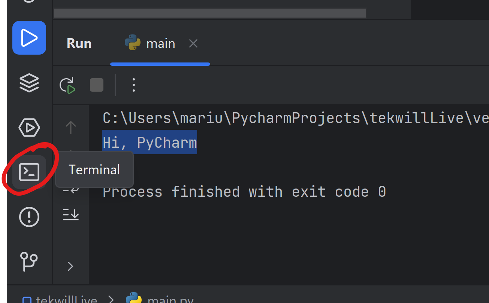
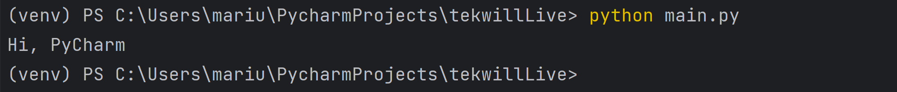

# Introducere Python Fundamentals

## Ce este programarea și de ce este importantă?

Programarea este procesul de scriere a unui set de instrucțiuni pentru a rezolva o problemă specifică printr-un calculator sau o mașină. Este arta de a crea programe și algoritmi care să controleze comportamentul unui sistem într-un mod precis și reproductibil. Programarea poate fi considerată ca fiind limbajul prin care comunicăm cu computerele și le instruim să execute anumite sarcini.

Iată de ce programarea este importantă:

1. Automatizarea: Programarea permite automatizarea unor sarcini repetitive și complexe. Putem programa computerele să efectueze sarcini plictisitoare și muncă grea într-un mod rapid și precis, ceea ce ne eliberează timpul pentru activități mai valoroase.

2. Rezolvarea problemelor: Programarea este un instrument puternic pentru a rezolva probleme complexe. Cu ajutorul programării, putem aborda diverse provocări și putem dezvolta algoritmi eficienți pentru a rezolva diverse probleme din lumea reală.

3. Inovație și creativitate: Programarea stimulează inovația și creativitatea. Oferă o platformă pentru a dezvolta și implementa idei noi și inovatoare într-un mod interactiv și experimental. Programatorii pot crea aplicații, jocuri, site-uri web și multe alte produse care pot transforma viețile oamenilor și pot schimba lumea în jurul nostru.

4. Gândire logică și analitică: Programarea ne ajută să dezvoltăm abilități de gândire logică și analitică. Procesul de a scrie un program implică dezvoltarea unui algoritm logic pentru a rezolva o problemă specifică. Programatorii trebuie să gândească pas cu pas, să analizeze situații și să identifice soluții eficiente.

5. Carieră și oportunități: Programarea deschide uși pentru o varietate de cariere și oportunități. Există o cerere crescută pentru programatori în industria tehnologică, iar cunoștințele de programare pot fi valorificate în diferite domenii, cum ar fi dezvoltarea software, analiza datelor, inteligența artificială, securitatea informatică și multe altele.

## Scopul programării și modul în care rezolvă probleme

Scopul programării este de a rezolva probleme și de a crea soluții eficiente folosind calculatorul sau mașina. Programarea oferă abilitatea de a transforma o problemă complexă într-un set de instrucțiuni clare și precise, cunoscute sub numele de cod sursă, pe care calculatorul le poate înțelege și executa.

Prin programare, putem rezolva o gamă largă de probleme, inclusiv:

1. Automatizarea sarcinilor: Programarea ne permite să automatizăm sarcini repetitive și muncă grea. Putem crea programe care să efectueze sarcini mecanice, cum ar fi procesarea datelor, generarea de rapoarte sau gestionarea resurselor, ceea ce ne economisește timp și efort.

2. Manipularea și analiza datelor: Programarea ne permite să manipulăm și să analizăm cantități mari de date. Putem crea algoritmi și programe care să sorteze, filtreze și să extragă informații relevante din seturi de date mari, ceea ce facilitează luarea deciziilor informate și descoperirea de modele sau tendințe ascunse.

3. Dezvoltarea de aplicații software: Programarea ne permite să dezvoltăm aplicații software pentru diverse scopuri. Putem crea aplicații mobile, aplicații web, programe de desktop și multe altele, care să ofere funcționalități și servicii utile utilizatorilor finali.

4. Crearea de site-uri web: Programarea ne permite să construim site-uri web interactive și dinamice. Putem crea pagini web atractive și funcționale folosind limbaje de programare precum HTML, CSS și JavaScript, pentru a oferi experiențe de utilizare plăcute și interacțiuni interactive.

5. Dezvoltarea de inteligență artificială și machine learning: Programarea joacă un rol esențial în dezvoltarea inteligenței artificiale și a tehnologiilor de învățare automată. Putem crea algoritmi și modele de învățare automată care să înțeleagă și să proceseze informații, să facă previziuni sau să ia decizii în baza datelor disponibile.

În esență, programarea ne oferă instrumentele necesare pentru a traduce problemele complexe într-un format pe care calculatorul îl poate înțelege și rezolva. Astfel, putem rezolva probleme diverse și putem crea soluții inovatoare și eficiente pentru a satisface nevoile noastre și ale societății în ansamblu.

## Principiile de bază ale programării: algoritmi, structuri de date și controlul fluxului

Principiile de bază ale programării sunt algoritmii, structurile de date și controlul fluxului. Aceste concepte fundamentale sunt esențiale pentru a crea programe eficiente și bine structurate. Iată o dezvoltare a fiecărui principiu:

1. Algoritmi:
   - Un algoritm este un set ordonat de pași sau instrucțiuni logice care rezolvă o anumită problemă sau îndeplinesc o anumită sarcină.
   - Algoritmii trebuie să fie precise, neambiguuți și capabili să rezolve problema într-un mod eficient.
   - În programare, algoritmii sunt implementați prin intermediul unui limbaj de programare și reprezintă o secvență logică de instrucțiuni.

2. Structuri de date:
   - Structurile de date reprezintă modul în care organizăm și stocăm datele într-un program.
   - Exemple comune de structuri de date includ: liste, tablouri, seturi, stive, cozi și arbori.
   - Alegerea corectă a unei structuri de date potrivite pentru o problemă dată poate afecta eficiența și performanța programului.

3. Controlul fluxului:
   - Controlul fluxului se referă la gestionarea și direcționarea executării programului în funcție de condiții și decizii.
   - Instrucțiunile de control al fluxului includ: structurile condiționale (if-else), buclele (for, while) și instrucțiunile de salt (break, continue, return).
   - Controlul fluxului permite programului să ia decizii și să execute diferite acțiuni în funcție de condiții specifice sau iterează prin seturi de date.

Aceste principii de bază ale programării sunt strâns interconectate și sunt folosite împreună pentru a crea programe eficiente și funcționale. Algoritmii ne ajută să gândim logic și să planificăm soluții, structurile de date ne permit să organizăm și să gestionăm informațiile, iar controlul fluxului ne permite să direcționăm executarea programului într-un mod flexibil și adaptabil.

În timpul studierii programării, este important să înțelegem aceste principii de bază și să le aplicăm în mod corespunzător pentru a dezvolta programe de calitate. Prin învățarea algoritmilor eficienți, a structurilor de date adecvate și a controlului fluxului coerent, putem crea soluții robuste și performante în diferite domenii ale programării.


## Ce este Python și de ce este popular în industria programării?

Python este un limbaj de programare de înalt nivel, interpretat și generalist, care a câștigat o popularitate semnificativă în industria programării. Iată o descriere a Pythonului și motivele pentru care este popular:

1. Simplitate și citibilitate:
   - Python este cunoscut pentru sintaxa sa simplă și citibilă, care face ca codul să fie ușor de înțeles și de scris.
   - Folosind un stil de scriere lizibil, Python încurajează dezvoltatorii să se concentreze asupra rezolvării problemelor, mai degrabă decât pe aspectele tehnice ale limbajului.

2. Abordare orientată spre productivitate:
   - Python pune accent pe productivitatea dezvoltatorului prin facilitarea dezvoltării rapide și eficiente a aplicațiilor.
   - Are o colecție bogată de biblioteci și module terțe, care oferă funcționalități extinse și ajută la rezolvarea rapidă a problemelor comune.

3. Versatilitate și portabilitate:
   - Python este un limbaj versatil, cu suport pentru diverse domenii și aplicații, de la dezvoltarea web și știința datelor până la automatizarea și dezvoltarea jocurilor.
   - Este disponibil pe diferite platforme și sisteme de operare, incluzând Windows, macOS și Linux, ceea ce îl face portabil și ușor de utilizat în diferite medii.

4. Comunitate puternică și resurse extinse:
   - Python beneficiază de o comunitate mare și activă de dezvoltatori care contribuie la dezvoltarea limbajului și la crearea de biblioteci și module utile.
   - Există o mulțime de resurse disponibile, cum ar fi documentație extinsă, tutoriale, forumuri și pachete de învățare, care facilitează învățarea și dezvoltarea cu Python.

5. Integrare și interoperabilitate:
   - Python poate fi integrat cu ușurință cu alte limbaje de programare, permițând dezvoltatorilor să capitalizeze funcționalitățile specifice ale altor limbaje și să creeze aplicații complexe și interconectate.
   - Există interfețe și librării care permit apelarea și utilizarea codului scris în C/C++, Java, și alte limbaje din Python.

6. Aplicații și utilizare extinsă:
   - Python este folosit într-o varietate de domenii, inclusiv dezvoltarea web, analiza datelor, inteligența artificială, automatizarea testelor, scriptingul sistemelor, dezvoltarea jocurilor și multe altele.
   - Popularitatea Pythonului se datorează și faptului că este utilizat de companii mari și organizații de top, inclusiv Google, Facebook, Netflix, NASA și multe altele.

În ansamblu, Python a câștigat popularitate în industria programării datorită simplității, productivității, versatilității și comunit

## Caracteristici și avantaje ale Pythonului.

Python este un limbaj de programare care oferă o serie de caracteristici și avantaje care l-au făcut popular în comunitatea programatorilor. Iată o descriere a câtorva dintre aceste caracteristici și avantaje ale Pythonului:

1. Sintaxă simplă și citibilă: Python utilizează o sintaxă simplă și citibilă, care face codul ușor de înțeles și de scris. Aceasta facilitează dezvoltarea rapidă și încurajează un stil de scriere lizibil și expresiv.

2. Limbaj de înalt nivel: Python este un limbaj de programare de înalt nivel, ceea ce înseamnă că oferă abstracțiuni puternice și niveluri ridicate de abstractizare. Acest lucru permite dezvoltatorilor să se concentreze mai mult pe rezolvarea problemelor și mai puțin pe detalii tehnice.

3. Interpretabil și portabil: Python este un limbaj interpretat, ceea ce înseamnă că codul sursă este tradus în timpul execuției. Aceasta facilitează dezvoltarea rapidă și experimentarea interactivă. De asemenea, Python este portabil și funcționează pe mai multe platforme și sisteme de operare.

4. Multi-paradigmă: Python suportă mai multe paradigme de programare, inclusiv programarea procedurală, orientată pe obiecte și funcțională. Acest lucru oferă dezvoltatorilor flexibilitate și opțiuni în abordarea diferitelor probleme de programare.

5. Biblioteci și ecosistem bogat: Python dispune de un ecosistem vast de biblioteci și module terțe care oferă funcționalități extinse. Aceste biblioteci acoperă o gamă largă de domenii, cum ar fi știința datelor, dezvoltarea web, automatizarea și inteligența artificială. Ele facilitează dezvoltarea rapidă a aplicațiilor și reduc efortul necesar pentru a construi funcționalități complexe.

6. Comunitatea Python: Python are o comunitate mare și activă de dezvoltatori care contribuie la dezvoltarea limbajului și la crearea de resurse și biblioteci utile. Comunitatea este cunoscută pentru sprijinul și ajutorul reciproc oferit, prin intermediul forumurilor, grupurilor de discuții și evenimentelor dedicate.

7. Utilizare în industrie: Python este utilizat într-o varietate de domenii industriale, cum ar fi dezvoltarea web, analiza datelor, inteligența artificială, automatizarea, scriptarea sistemelor și multe altele. Popularitatea sa în industrie se datorează capacității sale de a rezolva probleme complexe și de a oferi soluții eficiente.


# Setarea mediului

Urmăzați instrucțiunile din [setup](setup.md)

# Executarea primului program Python

După configurarea proiectului în PyCharm, veți fi întâmpinat de un fișier cu cod Python.

Acest fișier conține un program simplu care va afișa în consolă un mesaj.


```python
# This is a sample Python script.
def print_hi(name):
    print(f'Hi, {name}')
    
if __name__ == '__main__':
    print_hi('PyCharm')
```


## Executarea din PyCharm

Pentru a rula acest program, este necesar să faceți clic pe butonul play din IDE.


PyCharm va rula programul și veți vedea în consolă, care va apărea în partea de jos a ecranului, mesajul `Hi, PyCharm`.


## Executarea din Terminal (CMD)

Pentru a rula programul din terminal, puteți deschide terminalul în PyCharm: 

Pentru a rula fișierul cu programul nostru, puteți utiliza comanda: `python main.py`.

