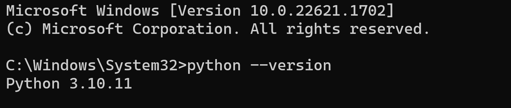
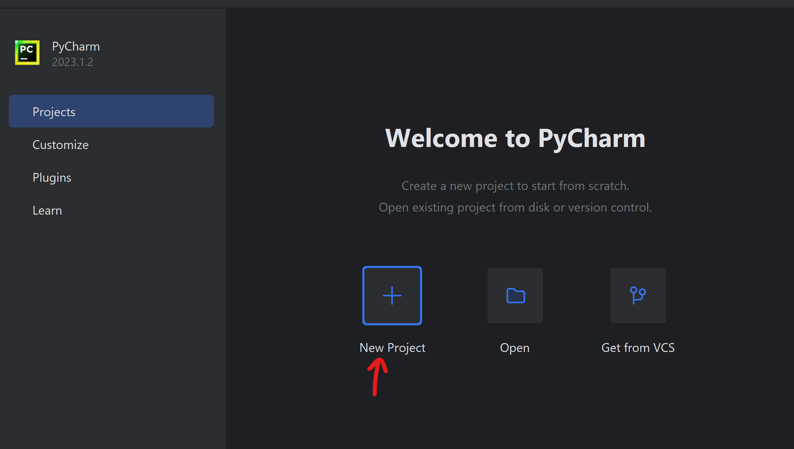
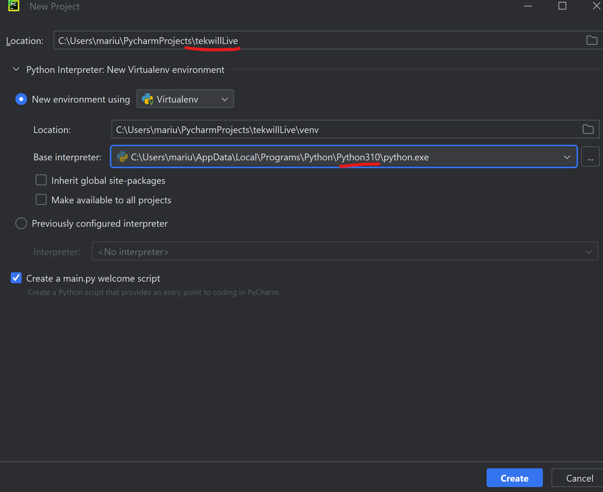

# Setarea mediului de lucru

## Instalarea Pythonului (3.10) pe sistemul de operare

Instalarea Python 3.10 pe sistemul de operare implică următorii pași:

1. Accesează site-ul oficial Python: Deschide un browser și accesează site-ul oficial Python la adresa https://www.python.org/. Asigură-te că accesezi versiunea corectă pentru sistemul de operare pe care îl utilizezi (Windows, macOS sau Linux).

2. Descarcă installerul Python: Navighează către pagina de descărcare a Python 3.10 și selectează versiunea potrivită pentru sistemul tău de operare. De obicei, există mai multe opțiuni de descărcare, cum ar fi instalerul pentru Windows, pachetele de instalare pentru macOS și diverse opțiuni pentru distribuțiile Linux.

3. Rulează installerul Python: După ce ai descărcat installerul, execută-l pentru a începe procesul de instalare. În timpul instalării, vei fi ghidat printr-un asistent care îți va solicita să alegi opțiunile de instalare și locația în care dorești să instalezi Python.

4. Configurează opțiunile de instalare: În timpul instalării, poți alege să adaugi Python în calea de sistem (sau să setezi variabilele de mediu corespunzătoare) pentru a putea accesa Python din orice director de la linia de comandă. De asemenea, poți selecta opțiunile suplimentare, cum ar fi adăugarea Python Launcher-ului sau a bibliotecilor standard.

5. Finalizează instalarea: După ce ai configurat toate opțiunile de instalare, apasă pe butonul "Install" sau "Next" pentru a începe instalarea Python. Așteaptă până când procesul de instalare se finalizează.

6. Verifică instalarea: După ce instalarea s-a încheiat cu succes, poți verifica dacă Python 3.10 a fost instalat corect. Deschide o fereastră de terminal (sau command prompt) și tastează comanda `python --version`. Dacă afișează versiunea 3.10, atunci instalarea a reușit.

Acum, Python 3.10 ar trebui să fie instalat pe sistemul tău de operare și ești gata să începi să lucrezi cu el. Poți crea și rula programe Python folosind un editor de text sau un mediu de dezvoltare integrat (IDE) care suportă Python.

## Configurarea mediului de dezvoltare (PyCharm IDE, Community Edition).

Configurarea mediului de dezvoltare PyCharm Community Edition implică următorii pași:

1. Descarcă și instalează PyCharm Community Edition: Accesează site-ul oficial al PyCharm (https://www.jetbrains.com/pycharm/) și descarcă versiunea gratuită, numită PyCharm Community Edition, potrivită pentru sistemul tău de operare (Windows, macOS sau Linux). Rulează installerul descărcat și urmează instrucțiunile pentru a instala PyCharm pe sistemul tău.

2. Lansarea PyCharm: După instalare, deschide PyCharm din meniul Start (Windows) sau din folderul de aplicații (macOS). PyCharm va fi lansat și vei fi întâmpinat cu ecranul de pornire.

3. Crează un proiect nou: 

În ecranul de pornire al PyCharm, poți alege să deschizi un proiect existent sau să creezi unul nou. Pentru a crea un proiect nou, selectează opțiunea "Create New Project". Alege locația unde dorești să fie salvat proiectul și stabilește setările de interpretor Python.

4. Configurarea interpretorului Python: În fereastra de configurare a proiectului, asigură-te că ai selectat interpretorul Python corespunzător. Dacă ai instalat Python 3.10, poți selecta interpretorul Python 3.10 din lista disponibilă. Dacă interpretorul Python nu este afișat în listă, apasă pe butonul "Show All..." și selectează interpretorul Python instalat manual.

5. Opțional: Configurarea setărilor de proiect: În funcție de preferințele și cerințele tale, poți configura și personaliza diverse setări de proiect, cum ar fi stilul de formatare a codului. Pentru a accesa setările de proiect, poți merge la "File" -> "Settings" (Windows/Linux) sau "PyCharm" -> "Preferences" (macOS).