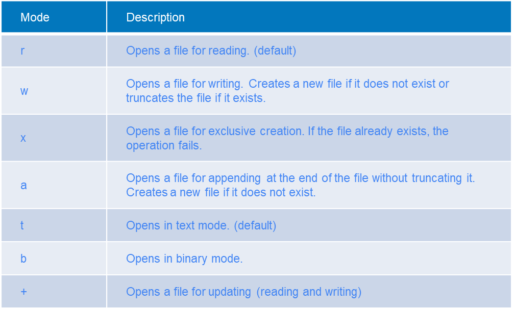

# Fișiere

Lucrul cu fișiere este întotdeauna dificil. Astăzi vom învăța noțiunile de bază despre cum să lucrăm cu ele.

### Crearea unui fișier

Pentru a deschide un fișier, putem folosi funcția **open** în Python.

Open este o funcție încorporată folosită pentru a lucra cu fișiere. Aceasta permite crearea, citirea și modificarea fișierelor.

Pentru a deschide un fișier, trebuie să specificăm doi argumente: numele fișierului (sau calea) și modul de deschidere.

Modelele disponibile sunt următoarele:

```
'r' - Deschide un fișier pentru citire. (implicit)
'w' - Deschide un fișier pentru scriere. Creează un fișier nou dacă nu există sau trunchiază fișierul dacă există.
'x' - Deschide un fișier pentru creare exclusivă. Dacă fișierul există deja, operația eșuează.
'a' - Deschide fișierul pentru adăugare la sfârșitul acestuia, fără a-l trunchia. Creează un fișier nou dacă nu există.
't' - Deschide în mod text. (implicit)
'b' - Deschide în mod binar.
'+' - Deschide un fișier pentru actualizare (citire și scriere).
```

```python
file = open('new_file.txt', 'w')
file.write('Hey, scriu într-un fișier')
file.close()
file = open('new_file.txt', 'r')
data = file.readline()
file.close()
print(f"Date din fișier: {data}")
```

Este important să închidem fișierul după deschidere, deoarece lipsa închiderii nu va salva datele și poate cauza alte probleme.

### Utilizarea cuvântului cheie 'with'

Cuvântul cheie **with** oferă un **gestionar de context**. Nu multe funcții au un gestionar de context, dar atunci când o au,
acest gestionar de context se ocupă de inițializarea și finalizarea unui obiect sau proces.

De exemplu, gestionarul de context **open** se ocupă de închiderea fișierului atunci când programul iese din blocul **with**.

```python
with open('new_file.txt', 'w') as file:
    file.write('Un text')
```

Acum nu mai trebuie să ne facem griji în legătură cu închiderea fișierului, deoarece gestionarul de context se va ocupa de aceasta singur.

Vom studia mai în detaliu gestionarii de context mai târziu, dar aceștia sunt foarte utili atunci când știm ce facem.

### w vs wb

Există două moduri principale de a deschide un fișier: modul text sau modul binar.

Modul text (**w** sau **

wt**, **at**) ne permite să scriem șiruri de caractere în fișier.

Modul binar (**wb**, **ab**) ne permite să scriem date binare. Acest lucru este util atunci când lucrăm cu date non-text, precum fișiere .docx, .pdf, .xlsx, .jpeg.

### Toate modurile



### Citirea și scrierea

Dacă încercăm să specificăm modul de deschidere ca **rw**, va eșua cu o eroare. Pentru a permite atât citirea, cât și scrierea în același fișier, putem folosi +. Astfel, modul de deschidere ar trebui să fie 'r+' sau 'w+'.

Dacă fișierul nu există, 'w+' va crea fișierul, dar 'r+' va genera o excepție.

```python
file = open('new_file.txt', 'w+')
print(file.writable())  # True
print(file.readable())  # True
```

Dacă dorim să citim date dintr-un fișier după ce au fost scrise, trebuie să resetăm **cursorul** în interiorul fișierului.

Acest lucru se face folosind metoda seek a fișierului.

La scrierea într-un fișier, cursorul se deplasează la sfârșitul a ceea ce a fost scris. Uneori, trebuie să "ajustăm" manual cursorul.

```python
file = open('new_file.txt', 'w+')
file.write('HeyHey')
file.seek(0)
data = file.read()
print(data)
file.close()
```

#### Modul de adăugare

Deschiderea unui fișier în modul de adăugare permite doar adăugarea la fișier. Nu va suprascrie datele existente.

```python
file = open('new_file.txt', 'a+')
file.write('HeyHey')
file.seek(0)
data = file.read()
print(data)
file.close()
```

# JSON

JSON este un format de schimb de date care este ușor de citit atât de oameni, cât și de calculatoare.

În structura sa, datele JSON seamănă foarte mult cu un **dict** în Python. De aceea, este destul de ușor să lucrăm cu fișiere JSON în Python.

JSON este un format foarte versatil. Ne permite să stocăm toate tipurile de date de bază (șiruri de caractere, numere întregi, numere reale, valori booleene), dar și unele mai puțin simple (dict-uri și liste).

Exemplu JSON:

```json
{
  "some_numbers": [
    1,
    2,
    3,
    4
  ],
  "a_number": 24.5,
  "a_boolean": true,
  "some_string": "Salut, sunt un șir de caractere",
  "a_dict_inside_the_json_file": {
    "name": "Sunt un dict"
  }
}
```

Puteți observa că JSON-ul de mai sus arată familiar, deoarece structura sa este similară cu cea a unui dict în Python.

În JSON, putem stoca un dict, sau o listă

de dict-uri, sau o listă de elemente, sau pur și simplu un element.

Exemple de stocare a unei valori în JSON:

```json
10
```

```json
"Sunt un șir de caractere în JSON"
```

```json
false
```

Stocarea unei liste de valori în JSON:

```json
[
  "Listă",
  "de",
  "șiruri de caractere"
]
```

```json
[
  10.2,
  10.3,
  10.4
]
```

Stocarea unui dict în JSON:

```json
{
  "value": 100
}
```

Stocarea unei liste de dict-uri în JSON:

```json
[
  {
    "name": "Marius"
  },
  {
    "name": "John"
  }
]
```

## Crearea JSON în Python

Putem folosi modulul json încorporat pentru a converti tipurile de date în și din JSON.

```python
import json

my_dict = {
    'name': "Marius",
    'username': "pythonguru1337",
    'password': "never_use_plaintext_password",
    'user_group': {'name': 'Admin', 'permissions': '__all__'},
}
json_string = json.dumps(my_dict)  # Creează un șir JSON din my_dict
print(my_dict)
print(json_string)
```

Dacă rulăm codul de mai sus, vom observa că structura dicționarului și a JSON-ului sunt aceleași.

```python
import json

list_of_users = [{
    'name': "Marius",
    'username': "pythonguru1337",
    'password': "never_use_plaintext_password",
    'user_group': {'name': 'Admin', 'permissions': '__all__'},
}, {
    'name': "Admin",
    'username': "administrator",
    'password': "admin",
    'user_group': {'name': 'Admin', 'permissions': '__all__'},
}]

json_string = json.dumps(list_of_users)  # Creează un șir JSON din list_of_users
print(list_of_users)
print(json_string)
```

### Ce poate fi transformat în JSON

Orice poate fi reprezentat folosind doar tipurile de date de bază (așadar: șiruri de caractere, numere, valori booleene, liste, dict-uri).

Obiectele complexe pot fi de asemenea reprezentate ca JSON, dar trebuie să treacă prin procesul de **serializare**.

Serializarea este acel proces în care definim cum să "dezmembrăm" tipul de date personalizat sau complex în altele mai simple (în general tot un dict).

### Limitări ale JSON

Nu ai voie să ai alte obiecte JSON ca chei, așadar cheile pot fi doar șiruri de caractere sau numere. Aceasta nu este o limitare critică, ci doar un aspect de reținut atunci când convertim în JSON.

## Convertirea înapoi din JSON

Putem converti la fel de ușor din JSON în Python cum am făcut și invers. Obiectul rezultat al unei conversii din JSON este întotdeauna fie un dict, fie o listă de dict-uri.

Pentru a converti textul JSON într-un obiect Python,

folosim funcția **json.loads()**.

```python
import json

my_dict = {'name': 'Marius'}
json_string = json.dumps(my_dict)  # Creează JSON din dict
print(json_string)
new_my_dict = json.loads(json_string)  # Creează dict din JSON
print(new_my_dict)
```

La fel de bine, funcționează și pentru liste.

```python
import json

my_list = [1, 2, 3, 4, 5]
json_string = json.dumps(my_list)
print(json_string)
new_list = json.loads(json_string)
print(new_list)
```

### De ce să folosim JSON?

JSON ne permite să stocăm informații în formă text, ceea ce face mai ușor pentru noi (dezvoltatorii) să lucrăm cu date într-un mod accesibil.

## Exemplu

Să creăm un program care stochează utilizatori și îi înregistrează într-un fișier.

```python
import hashlib
import json


def inregistrare_utilizatori(nr_utilizatori):
    lista_utilizatori = []
    for t in range(nr_utilizatori):
        username = input('Introduceți numele de utilizator: ')
        password = input('Introduceți parola: ')
        password = hashlib.md5(password.encode()).hexdigest()  # Criptarea parolei (niciodată să nu stocăm parola în text simplu)
        lista_utilizatori.append(
            {
                'username': username,
                'password': str(password)
            }
        )
    return lista_utilizatori


def salvare_utilizatori_in_fisier(lista_utilizatori):
    utilizatori_existenti = dict()
    try:
        with open('utilizatori.json', 'r') as fisier_usr:
            utilizatori_din_fisier = json.loads(fisier_usr.read())
            for utilizator in utilizatori_din_fisier:
                utilizatori_existenti[utilizator['username']] = utilizator  # Obținem toți utilizatorii din fișier
    except FileNotFoundError:
        pass
    except json.JSONDecodeError:
        pass

    for utilizator in lista_utilizatori:
        utilizatori_existenti[utilizator['username']] = utilizator

    with open('utilizatori.json', 'w') as fisier_usr:
        fisier_usr.write(json.dumps(list(utilizatori_existenti.values()), indent=4))


nr_utilizatori = int(input('Numărul de utilizatori de înregistrat: '))
utilizatori = inregistrare_utilizatori(nr_utilizatori)
salvare_utilizatori_in_fisier(utilizatori)
```

În exemplul de mai sus, avem două funcții: `inregistrare_utilizatori` și `salvare_utilizatori_in_fisier`. Funcția `inregistrare_utilizatori` solicită utilizatorului să introducă un nume de utilizator și o parolă și le stochează într-o listă de dict-uri. Funcția `salvare_utilizatori_in_fisier` citește utilizatorii existenți dintr-un fișier, îi combină cu utilizatorii înregistrați recent și salvează lista actualizată de utilizatori în fișier, în format JSON.

Programul solicită utilizatorului să introducă numărul de utilizatori de înregistrat, înregistrează utilizatorii și îi sal

vează în fișierul "utilizatori.json".

Vă rugăm să rețineți că exemplul presupune existența unui fișier "utilizatori.json" în același director cu scriptul.
