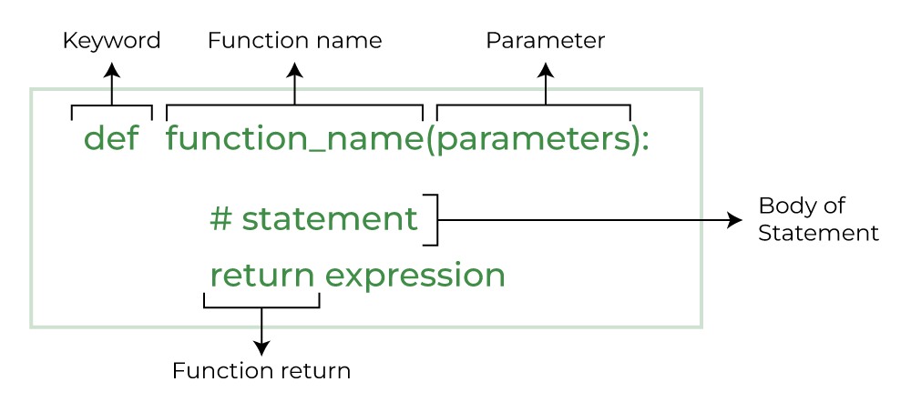

## What are Functions?

Functions are blocks of code that perform a specific task. They allow us to encapsulate a set of instructions and
execute them by calling the function name. Functions can take input arguments, process them, and optionally return a
value.

At it's core, functions are small programs (also called **snippets**), that should be executable as a single unit.

Remember that a program is something that takes an **input** -> does some **processing** and returns an **output**.

Here's an example of a simple function that greets a person, you may have seen such a function before.

```python
def greet(name):
    print("Hello, " + name + "!")


# Calling the greet() function
greet("John")
```

Output:

```
Hello, John!
```

Let's break apart the example piece by piece:



### The def keyword

In the example above, we **define** a function using the `def` keyword. This tells python that the following will be a
function definition.

After the `def` keyword, we must supply the function name, in our example, it is called `greet`.

> Please note that a function name should adhere to the same principles of declaring a variable (lowercase letters,
> combined using underscores): ex `greet_user` or `show_menu`.

### Function parameters (arguments)

> The name parameters and arguments is often used interchangeably
> Parameters are the variables listed within the parentheses in the function definition. They represent the placeholder
> names for the data that will be passed to the function when it is called.
> Arguments are the actual values that are passed to the function when it is called. They correspond to the parameters
> in the function definition.

When defining a function, we can provide parameters: The parameters serve as **input** to our function. When you think
about what parameters a function should receive, think about what **input** does my small program need to do its task.

The `greet` function above, requires to know the name of the person to greet, thus the only parameter it takes is
the `name` parameter.

> When specifying parameters, you must also adhere to the same principles of declaring a variable. It is also
> **important** that your parameter name does not conflict with any other existing names.

Example:

```python
def sum_list(list):  # The name of the parameter list conflicts with the built-in function name `list`
    return sum(list)


def sum_list(list_to_add):  # The name of the parameter list_to_add does not conflict
    print(sum(list))
```

#### What are function parameters ?

Function parameters are **temporary variables**, the values of those variables are only accessible inside the function,
and belong to the function.

The programmer can choose to do anything he likes to the parameters inside the function, however as soon as the function
has finished executing, all the values stored inside parameters will be _cleaned-up_.

We will get back to function parameters later in the lesson.

### Function body

After defining the function name, the function parameters, we can start working on the function body block.

As with any other block in python, we should **follow the indentation**, meaning everything indented to the right by
**1 tab** from the function definition is part of the functions **body**.

Inside the function body, the programmer can do anything he likes, for as many lines of code as he likes. The programmer
**can** use other functions, the programmer **can** also declare new variables, and the programmer **can** use
_control flow_ blocks such as conditionals or loops.

## What do we put inside a function

Consider the example below:

```python
def fahr_to_celsius(fahr_temp):
    print(f'Converting {fahr_temp} Fahr to Celsius')
    celsius_temp = (fahr_temp - 32) * 5 / 9
    return celsius_temp
```

The example is a small function that takes in a `temperature` value as an input parameters, and does operations on that
value to return a Celsius temperature value.

This is a very simple example, but it illustrates one extra aspect, which is the `return` keyword.

If I was going to use this function inside my program I would end up with a simple code like this:

```python
result = fahr_to_celsius(42)
print(f"42 converted to celsius is {result}")
```

Notice that I use my function to gather a `result` value, the `result` value is actually supplied by the function using
the `return` keyword, and it would be whatever that function will choose to return to me.

### The return keyword

The return keyword is the "exit point" of our function, meaning when a function **returns** a value, it has completed
successfully and no other code will be run inside the function.

```python
def greet_user(name):
    greeting = f'Hello, {name}'
    return greeting
    print(greeting)  # This line of code will never run, because our function returned on the line above
```

In the example of the temperature convertor function above, the output of the function (the result) will be dependent on
the **input** provided to the function.

If we apply control flow or other procedures inside a function, it may be less clear what the return value can be.

> Note: Not all functions will have (or should have) a return value, if we look at some built-in functions, the print
> function does not return anything, it just outputs to the console. At the same time, the input function,
> does return the value that was input.

## Function Parameters

Parameters refer to the way we "define" what our function input will be.

This is our last stop on the topic of defining parameters inside our function definition:

Our function can take two distinct types of parameters: **required parameters** and **optional parameters**

### Required parameters

Required parameters are parameters that are required for our function to work properly, we as a programmer **require**
that the parameter is supplied, otherwise the function can not be called.

Let's have the function below as an example:

```python
def greet_user(username, is_first_login, days_since_last_login):
    if is_first_login:
        greeting = f'Welcome, {username}'
    else:
        greeting = f'Welcome back, {username}'
    if days_since_last_login > 0:
        greeting = f"{greeting}, you haven't been here for {days_since_last_login} days."
    print(greeting)
    return greeting


greet_user('Marius', True, 0)  # Welcome, Marius
greet_user('Marius', False, 0)  # Welcome back, Marius
greet_user('Marius', False, 2)  # Welcome back, Marius, you haven't been here for 2 days.
```

In the example above, all the three parameters are **required**, meaning if I call the function using only two
parameters, the function will not run.

```python
greet_user('Marius', False)  # TypeError: greet_user() missing 1 required positional argument: 'days_since_last_login'
```

### Optional Parameters (default arguments)

Optional parameters come to help with such issues, and offer the programmer a way to specify a "default value" for a
argument if it was not supplied by the user.

Having the same example, but slightly modified will illustrate my point:

```python
def greet_user(username, is_first_login=False, days_since_last_login=0):
    if is_first_login:
        greeting = f'Welcome, {username}'
    else:
        greeting = f'Welcome back, {username}'
    if days_since_last_login > 0:
        greeting = f"{greeting}, you haven't been here for {days_since_last_login} days."
    print(greeting)
    return greeting


greet_user('Marius')  # Welcome back, Marius
greet_user('Marius', True)  # Welcome, Marius
greet_user('Marius', True, 13)  # Welcome, Marius, you haven't been here for 13 days.
```

In this new example, we specify two `default arguments` or `optional parameters`. The optional parameter are specified
using the `equal (=)` sign after the parameter name.

* `is_first_login` - receives a default value of `False`
    * Which means that if the programmer calling the function does not supply the value, it will automatically be
      considered `False`
* `days_since_last_login` - receives a default value of `0`
    * Which means that if the programmer calling the function does not supply the value, it would automatically be `0`.

A lot of practice is necessary to get proficient with the way we define arguments, as to **know** what the correct or
proper default values are. I can explain to you the reasoning behind what happens in the example above.

* If the programmer does not offer the `is_first_login` parameter, we assume that he is either lazy, or it is not his
  first login.
* If the programmer does not offer the value for `days_since_last_login`, we assume that the value is unknown, thus we
  will not show the message about `days since last here...`

Default arguments can be used in multiple different ways, coming back to our temperature converter example:

```python
def convert_temperature(temperature, to_unit='C'):
    if to_unit == 'C':
        # We assume temperature is fahrenheit
        pass
    elif to_unit == 'F':
        # We assume temperature is celsius
        pass
    else:
        raise ValueError(f"Unknown conversion to {to_unit}")
```

The function above will by default convert the `temperature` to celsius, unless instructed otherwise.

### Mutability note

Parameter default must always be immutable data types. You **should not** use mutable data types as parameter
defaults.

Let's look at an example.

```python
def append_to(element, to=[]):
    to.append(element)
    return to


my_list = append_to(12)
print(my_list)  # Output: [12]

my_other_list = append_to(42)
print(my_other_list)  # Output: [12, 42]
```

In this example, we have a function append_to() that takes an element to append and a list to append it to as arguments.
The default value for the `to` parameter is an empty list []. This means that if we do not explicitly provide a list,
the function will use the same empty list for all subsequent calls.

As you can see from the output, the to list is shared between all calls to the function. This means that changes made to
the list in one call will affect the list in all subsequent calls.

To avoid this issue, we can explicitly check for None within the function and create a new list if necessary. For
example, the following code fixes the append_to() function:

```python
def append_to(element, to=None):
    if to is None:
        to = []
    to.append(element)
    return to
```

### Argument Type Hints

Python supports type hints, which allow us to specify the expected types of function arguments and return values.
Although type hints are not enforced by the interpreter, they serve as documentation and can be checked using static
type checkers like `mypy`.

```python
def add_numbers(a: int, b: int) -> int:
    return a + b


# Calling the add_numbers() function with incorrect argument types
result = add_numbers("2", 3)
print(result)
```

Output:

```
TypeError: can only concatenate str (not "int") to str
```

In this example, we have declared that arguments `a` and `b` of the `add_numbers` function are expected to be integers.

We have also specified using the `->` notation that the result of the function will also be an integer.

Type hints in python are always **just a suggestion**, and are usually there to guide other programmers (or yourself) on
what you can supply to the function.

In the example above, the function fails, because of the mismatch in the type operations (addition of str to int), but
it could also lead to some unexpected results.

```python
result = add_numbers("2", "4")
print(result)  # 24
```

This time we dont get the error, this is because python **WILL NOT CHECK** if the arguments are of the correct type. The
concatenation of the strings will happen.

## Function Arguments

Function arguments refers to the way we **supply** arguments to our function.

Python supports three types of function arguments: positional arguments, keyword arguments, and default arguments.

### Positional Arguments

These arguments are passed based on their position in the function call. The values are assigned to the corresponding
parameters in the function definition.

```python
def greet(name, age):
    print("Hello, " + name + "! You are " + str(age) + " years old.")


# Calling the greet() function with positional arguments
greet("Alice", 25)
```

Output:

```
Hello, Alice! You are 25 years old.
```

In this example, the `name` and `age` parameters are positional arguments, and the values are assigned based on their
position in the function call.

### Keyword Arguments

Keyword arguments are passed with their corresponding parameter names during the function call. This allows for more
flexibility and readability.

```python
def greet(name, age):
    print("Hello, " + name + "! You are " + str(age) + " years old.")


# Calling the greet() function with keyword arguments
greet(name="Bob", age=30)
```

Output:

```
Hello, Bob! You are 30 years old.
```

Here, the function call explicitly mentions the parameter names, making it easier to understand the values being passed.

### Default Arguments

Default arguments have predefined values and can be omitted during the function call. If no value is provided, the
default value is used.

```python
def greet(name, message="Welcome"):
    print(message + ", " + name + "!")


# Calling the greet() function with and without the message argument
greet("Alice")
greet("Bob", "Greetings")
```

Output:

```
Welcome, Alice!
Greetings, Bob!
```

In this example, the `message` parameter has a default value of "Welcome". If the argument is not provided during the
function call, the default value is used.

### Returning Values from Functions

Functions can return values using the `return` statement. The returned value can be of any data type. When a function
encounters a `return` statement, it immediately exits, and the specified value is passed back to the caller.

```python
def square(num):
    return num * num


# Calling the square() function and storing the returned value
result = square(5)
print(result)
```

Output:

```
25
```

The `square()` function calculates the square of a number and returns the result. We can capture the returned value and
use it in other parts of our code.

### Function Side Effects

Functions can have side effects, which occur when a function modifies something outside of its own scope. Side effects
include changing the value of a global variable, modifying a data structure, or printing output to the console.

```python
count = 0


def increment_counter():
    global count  # Using the global keyword to allow modification of the `count` variable.
    count += 1


# Calling the increment_counter() function multiple times
increment_counter()
increment_counter()
increment_counter()

print(count)
```

Output:

```
3
```

In this example, the `increment_counter()` function modifies the value of the global variable `count` by incrementing
it. The function has a side effect on the variable.

### Positional vs Keyword Arguments

Python allows the use of both positional and keyword arguments together in function calls. Positional arguments must be
provided in the same order as the parameters in the function definition, while keyword arguments are passed with the
parameter names.

```python
def greet(name, message):
    print(message + ", " + name + "!")


# Calling the greet() function with a mix of positional and keyword arguments
greet("Alice", message="Hello")
greet(message="Greetings", name="Bob")
```

Output:

```
Hello, Alice!
Greetings, Bob!
```

Mixing both types of arguments provides flexibility and improves the clarity of function invocations.

## Other function related considerations

### Pass Keyword

The `pass` keyword is used as a placeholder when we want to create a function or a code block without any
implementation. It ensures that the code is syntactically correct. Let's see an example:

```python
def placeholder_func():
    pass


# Calling the placeholder function
placeholder_func()
```

No output will be generated from this function since it does not have any implementation yet. However, it is a valid
function that can be filled in later.

### Docstrings

Docstrings are string literals used to document Python modules, classes, methods, and functions. They serve as inline
documentation, providing information about the purpose, usage, and parameters of the function.

Here's an example of a function with a docstring:

```python
def add_numbers(a, b):
    """
    Adds two numbers and returns the result.
    Parameters:
    a (int): First number
    b (int): Second number
    Returns:
    int: Sum of the two numbers
    """
    return a + b


# Accessing the docstring
print(add_numbers.__doc__)
```

Output:

```
Adds two numbers and returns the result.
Parameters:
a (int): First number
b (int): Second number
Returns:
int: Sum of the two numbers
```

The `__doc__` attribute allows us to access the docstring associated with the function.

## Conclusion

Congratulations! You have now learned about Python functions, their arguments, return values, side effects, default
arguments, and argument type hints. Functions are powerful tools that enable code reuse and organization. Utilize them
effectively to write clean, modular, and efficient code.

