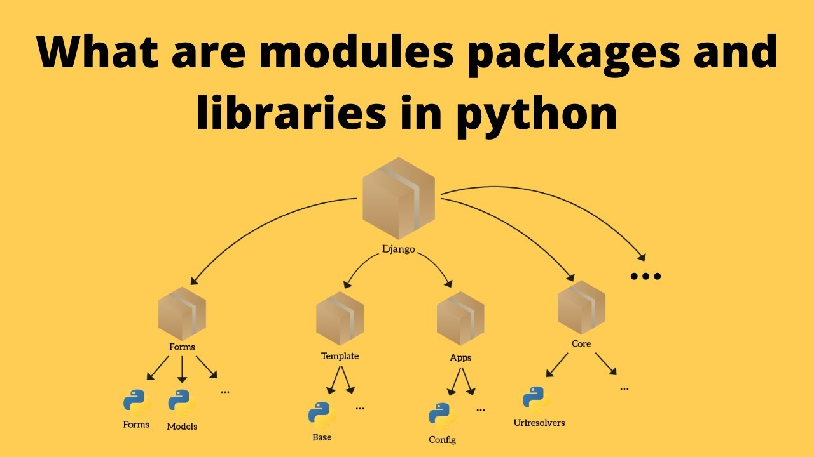

## What are we doing here ?

Whenever we work on a larger project, or a large program, we tend to make our `.py` files overcrowded.
Python offers a variety of tools and techniques to organize and structure code, enhancing its maintainability,
re-usability, and overall development efficiency. Among these, modules and packages stand out as fundamental concepts
that play a crucial role in building well-structured Python programs.



### Modules:

The building blocks of organized Python code, modules serve as self-contained units of code that encapsulate specific
functionalities or data structures. They act as mini-programs, containing functions, variables, and classes that can be
imported into other modules or directly executed from the command line.

By breaking down large programs into modules, developers can organize code logically, separating concerns and improving
overall readability. This modular approach facilitates code reuse, allowing developers to share common functionality
across multiple projects, enhancing development productivity.

### Packages:

Packages, a higher-level abstraction of modules, provide a hierarchical organization for managing large
projects. They group related modules together under a common name, creating a structured directory structure that
mirrors the project's logical structure.

Packages enable developers to structure large code bases effectively, avoiding the complexity of managing a single
directory of modules. They provide a clear hierarchy, making it easier to locate specific modules and maintain
consistency within the project.

### The Benefits of Packages and Modules

The benefits of using packages and modules in Python are manifold:

1. Enhanced Readability: Modular code is easier to read, understand, and maintain, especially for large projects
   involving multiple developers.

2. Improved Reusability: Code written in modules can be easily reused across different parts of the project or even
   incorporated into other projects.

3. Reduced Debugging Efforts: Modular code makes it easier to identify and isolate errors, as each module can be tested
   independently.

4. Enhanced Collaboration: Modularity facilitates collaboration among developers by promoting code sharing and reuse.

5. Modularity Enhances Scalability: As project requirements grow, modular code can be easily extended and adapted
   without disrupting the overall structure.

### The drawbacks of using Packages and Modules

There are also some drawbacks to this approach:

1. Needing to learn structural patterns - As projects grow, the programmer must not only think about structure, but
   learn the most efficient ways to structure code.
2. Naming Structure - You should have a structure that ensures the names of the modules and packages follow a set of
   rules, that make the files and folders easy to recognize and navigate.
3. Project navigation - Individual `.py` files (modules) are easier to navigate however the project as a whole grows
   having multiple files that must be open or navigated at the same time makes it confusing to work with at first.

Luckily the last problem has been taken care of by the `IDE` (Pycharm), the first two problems need to be solved by
experience.

## Structuring a simple application

Let's say we have a simple application: The application is a calculator which has the following options:

* Add two numbers
* Subtract two numbers
* Multiply two numbers
* Divide two numbers

```python
def add(num1, num2):
    return num1 + num2


def subtract(num1, num2):
    return num1 - num2


def multiply(num1, num2):
    return num1 * num2


def divide(num1, num2):
    if num2 == 0:
        raise ZeroDivisionError("Cannot divide by zero")
    return num1 / num2


def display_menu():
    print("Calculator")
    print("------------------")
    print("Select an operation (+, -, *, /): ")


def input_numbers():
    try:
        num1 = float(input("Enter the first number: "))
        num2 = float(input("Enter the second number: "))
    except Exception as ex:
        print("Error, numbers are not float")
        return
    return num1, num2


def display_result(operation, num1, num2, result):
    print("Operation:", operation)
    print("First number:", num1)
    print("Second number:", num2)
    print("Result:", result)


def get_function_for_operation(operation):
    match operation:
        case '+':
            return add
        case '-':
            return subtract
        case '*':
            return multiply
        case '/':
            return divide


def main():
    while True:
        display_menu()
        operation = input("Enter your choice: ")

        numbers = input_numbers()
        if not numbers:
            continue
        num1, num2 = numbers  # unpacking

        operation_function = get_function_for_operation(operation)
        try:
            result = operation_function(num1, num2)
            display_result(operation, num1, num2, result)
        except Exception as ex:
            print(ex)

        continue_calculation = input("Do you want to continue calculating? (Y/N): ")
        if continue_calculation.lower() == "n":
            break


if __name__ == "__main__":
    main()
```

The application above is already properly structured internally, which means that every function is well structured,
which makes it easy to de-couple the application.

The way the application is written above, makes it easy for a programmer to re-use the "`display_menu`" function, or
the `input_numbers` function, in multiple other parts of the program as well.

In what follows, we will work on structuring our application.

> Note: Consider that all the code in the example above is inside `main.py`.

## What are modules ?

Modules - Individual `.py` files that contain python code are Python Modules.

Python modules are the first building block of our structure, and hold anything a python file can hold, variables,
functions, constants, and classes.

## What are packages ?

Packages are **folders**, which contain multiple `.py` files. When structuring information in a specific package, we
think of it in the manner of keeping .py files together that do almost the same thing, or belong together.

You could think of it the same way as you would think about structuring your photos. You would put your holiday photos
in a folder called Holidays, you would probably also go further and put the photos from your trip to Italy in a
different folder than the ones from your visit to Spain.

Resulting in a structure like seen below:

```
├─ Photos
|   ├─ Holidays
|   │   ├─ italy
|   |   │   └─ 111.jpg
|   │   ├─ spain
|   |   │   └─ 112.jpg
|   │   ├─ australia
|   |   └─  └─ 122.jpg
|   ├─ Birthdays
|   │   ├─ 2022
|   |   │   ├─ 123.jpg
|   |   │   └─ ...
|   │   ├─ 2023
|   |   │   ├─ 123.jpg
|   |   └─  └─ ...
```

In the case above case `holidays`, `birhdays` are packages, `2022, 2023` are also packages inside the `birthdays`
package.

Similarly, in a program we may have:

```
├─ Project
|   ├─ database
|   │   ├─ models
|   │   |   ├─ __init__.py
|   |   │   └─ user.py
|   │   ├─ services
|   │   |   ├─ __init__.py
|   │   ├─  ├─ user_data.py
|   |   │   └─ user_operations.py
|   │   ├─ validators
|   │   |   ├─ __init__.py
|   |   └─  └─ user_validation_service.py
|   ├─ menus
|   │   ├─ registration
|   │   |   ├─ __init__.py
|   |   │   ├─ user_registration.py
|   |   │   └─ registration_contants.py
|   │   ├─ login
|   │   |   ├─ __init__.py
|   |   │   ├─ user_login.py
|   |   └─  └─ login_constants.py
```

#### What's init.py

`__init__.py` is a special file that is used to **initialize** a package, it became optional starting Python 3.7, but is
still widely used to this day. Inside our `__init__.py` file we can do various things, such as:

* declare import shortcuts (for easier package imports)
* declare package initialization logic, such as validations and set-up
    * For example, a file-storage package may check if the folder exists and can be written to

Every time you import a function, variable or module from inside a package or it's modules, the `__init__.py` will be
executed.

## Breaking up the project into multiple files

Starting with a structure that looks like this:

````
├─ main.py
````

What we can do is break up our code into 4 modules.

* `input_helpers.py` - All logic related to handling user input
* `calculator.py` - All calculation logic
* `display_helpers.py` - Logic related to showing information to the user
* `main.py` - Main program to be run.

The resulting structure would look like this.

````
├─ main.py
├─ calculator.py
├─ display_helpers.py
├─ input_helpers.py
````

With the modules now each containing their respective logic:

```python
# calculator.py
def add(num1, num2):
    return num1 + num2


def subtract(num1, num2):
    return num1 - num2


def multiply(num1, num2):
    return num1 * num2


def divide(num1, num2):
    if num2 == 0:
        raise ZeroDivisionError("Cannot divide by zero")
    return num1 / num2


def get_function_for_operation(operation):
    match operation:
        case '+':
            return add
        case '-':
            return subtract
        case '*':
            return multiply
        case '/':
            return divide
```

```python
# display_helpers.py
def display_menu():
    print("Calculator")
    print("------------------")
    print("Select an operation (+, -, *, /): ")


def display_result(operation, num1, num2, result):
    print("Operation:", operation)
    print("First number:", num1)
    print("Second number:", num2)
    print("Result:", result)
```

```python
# input_helpers.py
def input_numbers():
    try:
        num1 = float(input("Enter the first number: "))
        num2 = float(input("Enter the second number: "))
    except Exception as ex:
        print("Error, numbers are not float")
        return
    return num1, num2
```

```python
# main.py
from input_helpers import input_numbers
from display_helpers import display_menu, display_result
from calculator import get_function_for_operation


def main():
    while True:
        display_menu()
        operation = input("Enter your choice: ")

        numbers = input_numbers()
        if not numbers:
            continue
        num1, num2 = numbers  # unpacking

        operation_function = get_function_for_operation(operation)
        try:
            result = operation_function(num1, num2)
            display_result(operation, num1, num2, result)
        except Exception as ex:
            print(ex)

        continue_calculation = input("Do you want to continue calculating? (Y/N): ")
        if continue_calculation.lower() == "n":
            break


if __name__ == "__main__":
    main()
# main.py
```

### What happened above

Please note that in the example above, we have moved our functions to be in respective modules that "fit" their
description best. In this way, we have created new modules, each with its own **purpose**.

Now, each of those individual module contains less code, making it easier to read the entire module, but also, it makes
it easier to find a function.

If I, as a programmer was wondering where should I check on how the numbers are being input, I would look
into `input_helpers.py` because it has something to do with input.

The `main.py` is our main **entry point** of the program, meaning that a lot happens there.

If we look at the contents of the `main` module, we will notice that at the top of the module, something knew appeared.

The `from <module_name> import <function>` statement.

## Importing functions from other files

Python allows importing values, functions and other things from different modules (files).

In the file above we have a function, that we may want to use across different python files.

In python, there are two ways to import stuff (variables, functions):

1. Importing the entire module using the **import** keyword
2. Importing the specific function/object/variable, using `from <module_path> import <item_name>, <item_name_2>`

Let's restructure our application a bit to show off our examples better.

Consider the new structure:

```
├─ console_interface
|   ├─ input
│   │   ├─ __init__.py
|   │   └─ helpers.py
|   ├─ output
│   │   ├─ __init__.py
|   │   └─ helpers.py
├─ __init__.py
├─ calculator.py
└─ main.py
```

With this new structure, the code isnide our `main.py` changes as well.

```python
# main.py
from console_interface.input.helpers import input_numbers
from console_interface.output.helpers import display_menu, display_result
from calculator import get_function_for_operation

# ... rest of the code
```

Please note the way we navigate our packages:

We "path" towards our functions by separating the path using dots.

`console_interface.input.helpers` - This gets the helpers **module**, inside the **input** package inside the
console_interface **package**.

### Importing the entire module

The entire module can be imported using the `import` keyword, followed by the path to the module to import.

Importing the entire module allows us to use all the functions inside the module, giving us the entire **module** as a
variable.

```python
from console_interface.input import helpers  # Import helpers module from input package
import calculator  # Import calculator module

result = helpers.input_numbers()  # We access the function from inside our module

add_res = calculator.add(1, 2)
```

There is a small conflict however if we have multiple modules with the same name to import from different packages, here
we can see that there is also the helpers module inside the `output` package.

We can fix that by specifying import aliases.

```python
import console_interface.input.helpers as input_help  # Importing the module
from console_interface.output import helpers as out_help  # Also importing the module

result = input_help.input_numbers()  # We access the function from inside the input helpers
out_help.display_menu()  # We access the function from inside the output helpers
```

### Importing specific functions from a module

Depending on the quantity of functions inside a module you need, you may opt to import the specific function instead.

```python
from console_interface.input.helpers import input_numbers
from console_interface.output.helpers import display_menu, display_result
from calculator import get_function_for_operation
```

### Which way is the best

In my opinion, importing the entire module is **messy**, but sometimes necessary, especially when using a lot of
functions, and intending to **show** that the function **belongs** in the module.

```python
import math

# This is a bit more readable
print(math.sqrt(10))
print(math.sin(10))

from math import cos, acos

# this is a little bit less readable
print(cos(10))
print(acos(10))
```

## name == main ?

Remember ``if __name__ == __main__: `` ?

Well, here is where it comes in as very important.

If our `input_helpers.py` file has any code that runs inside the script. It will also be evaluated during the import.

```python
# input_helpers.py
def input_numbers():
    try:
        num1 = float(input("Enter the first number: "))
        num2 = float(input("Enter the second number: "))
    except Exception as ex:
        print("Error, numbers are not float")
        return
    return num1, num2


# Testing input numbers function
print(input_numbers())  # Executing the line
```

If we now import the **input_helpers** module inside our `main.py`, input_numbers() function will be executed from
inside the `input_helpers.py`.

This is because, when python imports the module, it evaluates the entire module, meaning that all the code inside the
module is being executed.

In order to fix this, we use ``__name__ == '__main__'``

This will check, that the code is evaluated not as part of an import but as part of the script execution.

````python
# input_helpers.py
def input_numbers():
    try:
        num1 = float(input("Enter the first number: "))
        num2 = float(input("Enter the second number: "))
    except Exception as ex:
        print("Error, numbers are not float")
        return
    return num1, num2


if __name__ == '__main__':  # This will only run if we run input_helpers.py directly, importing it will do nothing
    # Testing input numbers function
    print(input_numbers())  # Executing the line
````

Now if we import the `input_helpers` module, the **`input_numbers`** function **`input_helpers`** module will not be
executed.

But if we run the `input_helpers.py` program directly, it will still ask to input the two numbers for testing.

### Importing multiple functions/values with same name

Say you have 2 functions in different packages that have the same name

functions.py

```python
def factorial(nr):
    pass  # Implement factorial here
```

main.py

```python
from functions import factorial
from math import factorial
```

Above we have imported 2 functions with the name factorial. This means that only the lower function will be used.

If you want to use both functions separately you can give the function a nickname. Using the keyword **as**

```python
from functions import factorial as my_factorial
from math import factorial as math_factorial
```

## Don't worry about imports yet

Imports are very important in working with small to large programs, but you don't have to worry, because most of the
time, your IDE will help you with them.
