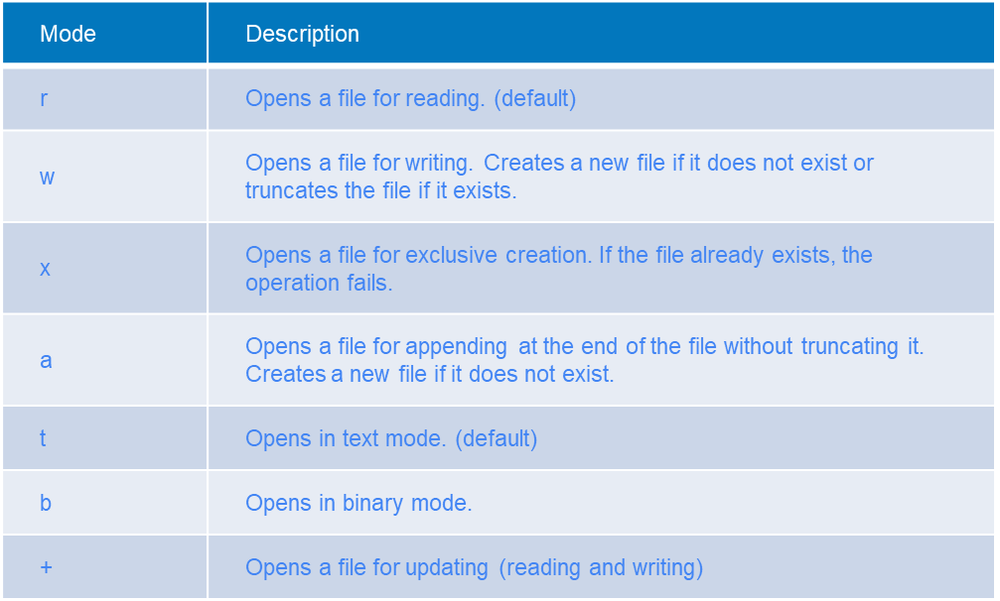

## Files

In the realm of software development, the ability to manipulate files is an essential skill for any programmer. Whether
it's reading data from a text file, storing user-generated information, or generating content for output, file handling
plays a crucial role in building robust applications. And in Python, this task is handled seamlessly with the `open()`
function, your gateway to file operations.

Working with files is always tricky. Today we will learn the basics of how to work with them.

### Creating a file

To open a file, we can use the **open** function in Python.

Open is a built-in function used to work with files. It allows us to create, read, and modify files.

In order to open a file, we need to specify two arguments: the file name (or path) and the open mode.

The available modes are as follows:

```
'r' - Open a file for reading. (default)
'w' - Open a file for writing. Creates a new file if it does not exist or truncates the file if it exists.
'x' - Open a file for exclusive creation. If the file already exists, the operation fails.
'a' - Open for appending at the end of the file without truncating it. Creates a new file if it does not exist.
't' - Open in text mode. (default)
'b' - Open in binary mode.
'+' - Open a file for updating (reading and writing).
```

```python
file = open('new_file.txt', 'w')
file.write('Hey, I\'m writing to a file')
file.close()
file = open('new_file.txt', 'r')
data = file.readline()
file.close()
print(f"Data from the file: {data}")
```

It is important to close the file after opening it, as not closing it will not save the data and may cause other issues.

### with context-manager

To ensure proper file handling and prevent potential errors, Python introduces context managers. These are denoted by
the `with` statement and automatically open and close the file for you within the `with` block. This eliminates the need
to explicitly call the `close()` method, making the code more concise and less error-prone.

The **with** keyword provides a **context manager**. Not a lot of functions provide a context manager, but when they do,
context managers handle the initialization and finalization of an object or process.

For example, the **open** context manager will handle closing the file when the program exits the **with** block.

```python
with open('new_file.txt', 'w') as file:
    file.write('Some text')
```

Now we don't need to worry about closing the file, as the context manager will do this by itself.

This helps us avoid situations like the one below:

```python
file = open('file.txt')
try:
    file_data = file.read()
    info_index = file_data.index('Info: ')
    necessary_info = file[info_index:info_index + 20]
except IndexError:
    print("Could not find info")
finally:
    file.close()
```

The `with` statement would help us get rid of the `finally` clause.

We will study context managers more in-depth a bit later, but they are very useful when you know what you are doing.

### w vs wb

There are two main ways to open a file: text mode or byte mode.

Text mode (**w** or **wt**, **at**), as we've seen, allows us to write textual data-textual data refers to any data
stored in a clear textual representation, files like .csv, .json, .xml or .txt, among others.

Byte mode (**wb**, **ab**) allows us to write binary data. This is useful when we're working with non-text data, like
.docx, .pdf, .xlsx, .jpeg files.

### All modes



### Reading and writing

If you try to specify the open mode as **rw**, it will fail with an error. In order to allow both reading and writing to
the same file, you can use the +. So the open mode should be 'r+' or 'w+'.

If the file doesn't exist, 'w+' will create the file, but 'r+' will raise an exception.

```python
file = open('new_file.txt', 'w+')
print(file.writable())  # True
print(file.readable())  # True
```

If you want to read data from a file after it has been written, you should reset the **cursor** inside the file.

This is done using the seek method of the file.

When writing to a file, the cursor shifts to the end of what was written. You may need to manually "adjust" the cursor
sometimes.

```python
file = open('new_file.txt', 'w+')
file.write('HeyHeyHey')
file.seek(0)  # This tells to move the cursor to the first position in the file.
data = file.read()
print(data)
file.close()
```

Any read or write operation inside a file will move the **cursor** as the file is being processed, sometimes (although
rarely) we may need to adjust the cursor position.

#### Append mode

Opening a file in append mode only allows adding to the file. It will not overwrite existing data.

```python
file = open('new_file.txt', 'a+')
file.write('HeyHey')
file.seek(0)
data = file.read()
print(data)
file.close()
```

### Best Practices for Efficient File Management

Effective file path management is crucial for navigating files correctly. Here are some best practices to follow:

1. **Absolute Paths:** Use absolute paths for consistent file references, especially when the file location doesn't
   change.
    * An example absolute path is: `/home/user/Documents/file.txt` or `C:\Users\Admin\Documents\file.txt` in windows.

2. **Relative Paths:** Utilize relative paths for files within the current working directory. This simplifies file
   access when working within a specific project or application.
    * An example relative path is: `file.txt` the path is relative to our `current working directory` in python, which
      can be found using `os.getcwd()`. If our `cwd` is `/home/user/Documents/` then the path `file.txt` will
      be `/home/user/Documents/file.txt` and the path `folder/other_file.txt` would
      be `/home/user/Documents/folder/other_file.txt`.
    * Relative paths are Relative to the `cwd`

3. **Sanitize User Input:** Always sanitize user-provided file paths to prevent malicious characters or unexpected
   directory changes.

### Conclusion

The `open()` function, complemented by context managers, binary and textual modes, and proper file path handling,
empowers Python developers to handle files with proficiency. By following these guidelines, you can effectively read,
write, and manage files in your Python applications, ensuring data integrity and seamless file interactions.

## JSON

JSON is a data-interchange format that is easily human and computer-readable.

In its structure, JSON data strongly resembles a lot of Python's built in data structures. This is why it's pretty easy
to work with JSON files
in Python.

JSON is a very versatile format. It allows us to store all base data types (string, int, float, boolean) but also some
less simple ones (dicts and lists).

Example JSON:

```json
{
  "some_numbers": [
    1,
    2,
    3,
    4
  ],
  "a_number": 24.5,
  "a_boolean": true,
  "some_string": "Hey, I'm a string",
  "a_dict_inside_the_json_file": {
    "name": "I am a dict"
  }
}
```

You can see that the JSON above looks oddly familiar. That's because the structure is similar to that of a dict in
Python. In JSON this data structure is called an `object`.

In JSON, you can store a dict, or a list of dicts, or a list of elements, or simply an element.

Storing one value in JSON examples:

```json
10
```

```json
"I am a string inside JSON"
```

> Note that the quotes should only be double quotes.

```json
false
```

> Note that false/true in Json is different than in Python

Storing a list of values in JSON:

```json
[
  "List",
  "of",
  "strings"
]
```

```json
[
  10.2,
  10.3,
  10.4
]
```

Storing a dict in JSON:

```json
{
  "value": 100
}
```

Storing a list of dicts in JSON:

```json
[
  {
    "name": "Marius"
  },
  {
    "name": "John"
  }
]
```

## Creating JSON in Python

We can use the built-in json module to convert data types from and to JSON.

```python
import json

my_dict = {
    'name': "Marius",
    'username': "pythonguru1337",
    'password': "never_use_plaintext_password",
    'user_group': {'name': 'Admin', 'permissions': '__all__'},
}
json_string = json.dumps(my_dict)  # Creates a JSON string from my_dict
print(my_dict)
print(json_string)
```

If we run the code above, we will notice that the structure of our str dict representation and our JSON is the same.

```python
import json

list_of_users = [{
    'name': "Marius",
    'username': "pythonguru1337",
    'password': "never_use_plaintext_password",
    'user_group': {'name': 'Admin', 'permissions': '__all__'},
}, {
    'name': "Admin",
    'username': "administrator",
    'password': "admin",
    'user_group': {'name': 'Admin', 'permissions': '__all__'},
}]

json_string = json.dumps(list_of_users)  # Creates a JSON string from my_dict
print(list_of_users)
print(json_string)
```

### What can we JSON-ify

Everything that can be represented in base data types alone (so: strings, numbers, bools, lists, dicts)

Complex objects can also be represented as JSON, but they need to go through the process of **serialization**.

Serialization is where we define how to "break down" our custom or complex data type into more basic ones (usually still
a dict).

### Limitations of JSON

You are not allowed to have other JSON objects as keys, so basically, keys can only be strings or numbers. This is not a
critical limitation; it's just something to keep in mind when converting to JSON.

## Converting back from JSON

We can easily convert from JSON as we do to JSON. The resulting object from a JSON conversion is always either a dict or
a list of dicts.

To convert JSON text to a Python object, use the **json.loads()** function.

```python
import json

my_dict = {'name': 'Marius'}
json_string = json.dumps(my_dict)  # Create JSON from dict
print(json_string)
new_my_dict = json.loads(json_string)  # Create dict from JSON
print(new_my_dict)
```

Similarly, a list will work just as well.

```python
import json

my_list = [1, 2, 3, 4, 5]
json_string = json.dumps(my_list)
print(json_string)
new_list = json.loads(json_string)
print(new_list)
```

### Why use JSON?

JSON allows us to store information in textual form, which makes it easy for us (the developers) to work with data in an
accessible way.

## Example

Let's create a program that stores users and registers users in a file.

```python
import hashlib
import json


def register_users(nr_of_users):
    user_list = []
    for t in range(nr_of_users):
        username = input('Input username: ')
        password = input('Input password: ')
        password = hashlib.md5(password.encode()).hexdigest()  # Hashing password (never store plaintext password)
        user_list.append(
            {
                'username': username,
                'password': str(password)
            }
        )
    return user_list


def save_users_to_file(user_list):
    existing_users = dict()
    try:
        with open('users.json', 'r') as usr_file:
            users_in_file = json.loads(usr_file.read())
            for user in users_in_file:
                existing_users[user['username']] = user  # Getting all users from the file
    except FileNotFoundError:
        pass
    except json.JSONDecodeError:
        pass

    for user in user_list:
        existing_users[user['username']] = user

    with open('users.json', 'w') as usr_file:
        usr_file.write(json.dumps(list(existing_users.values()), indent=4))


nr_of_users = int(input('Number of users to register: '))
users = register_users(nr_of_users)
save_users_to_file(users)
```

In the example above, we have two functions: `register_users` and `save_users_to_file`. The `register_users` function
prompts the user to input a username and password and stores them in a list of dicts. The `save_users_to_file` function
reads the existing users from a file, merges them with the newly registered users, and saves the updated list of users
back to the file in JSON format.

The program asks the user for the number of users to register, registers the users, and saves them to the "users.json"
file.

Please note that the example assumes the existence of a "users.json" file in the same directory as the script.
