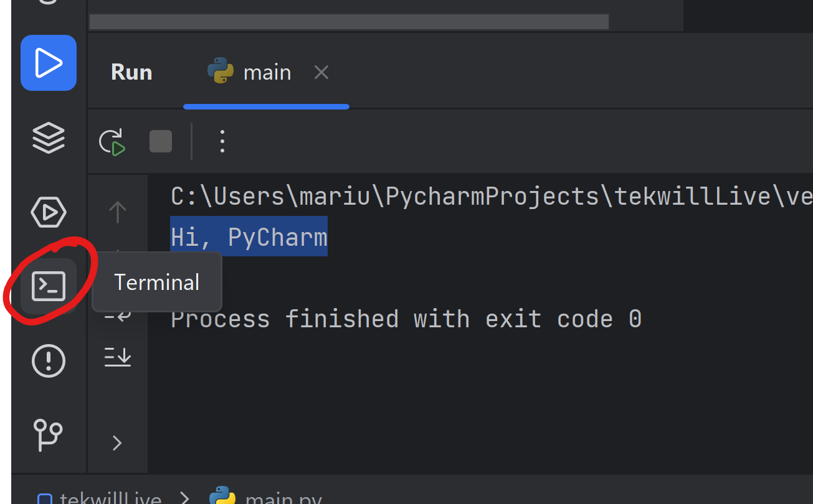
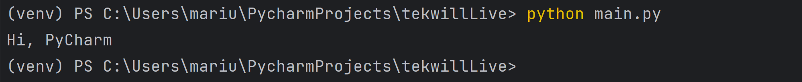

## What you need to know about computers

### Computers aren't smart

All that computers do is execute instructions, and at it's fundamentals they are just advanced
"calculators".


But computer can't understand humans, all the understand is Ones and Zeroes `00101001010`. And it would be very hard for
us to understand computers as well.

That's where Programming Languages come in.

### Computers execute instructions, that's what they excel at

Over the course of history, a lot of development has been made both to computer hardware (processors, memory) and the
software.

Although computers work only using ones and zeroes, those can be interpreted by the computer as a set of instructions.

The instructions your processors work with are mostly very basic, but programming languages provide a layer in between
the programmer and the processor, to make possible the development of complex algorithms and processes.

## The Purpose of Programming and How It Solves Problems

The purpose of programming is to solve problems and create efficient solutions using the computer or machine.
Programming provides the ability to translate a complex problem into a set of clear and precise instructions, known as
source code, which the computer can understand and execute.

Through programming, we can solve a wide range of problems, including:

1. **Task Automation:** Programming allows us to automate repetitive and labor-intensive tasks. We can create programs
   that perform mechanical tasks, such as data processing, report generation, or resource management, saving us time and
   effort.

2. **Data Manipulation and Analysis:** Programming allows us to manipulate and analyze large amounts of data. We can
   create algorithms and programs that sort, filter, and extract relevant information from large datasets, making
   informed decisions and discovering hidden patterns or trends.

3. **Software Application Development:** Programming allows us to develop software applications for various purposes. We
   can create mobile apps, web apps, desktop programs, and more, providing useful functionalities and services to end
   users.

4. **Website Development:** Programming enables us to build interactive and dynamic websites. We can create attractive
   and functional web pages using programming languages such as HTML, CSS, and JavaScript, providing pleasant user
   experiences and interactive interactions.

5. **Development of Artificial Intelligence and Machine Learning:** Programming plays a crucial role in the development
   of artificial intelligence and machine learning technologies. We can create algorithms and machine learning models
   that understand and process information, make predictions, or make decisions based on available data.

In essence, programming provides us with the tools to translate complex problems into a format that the computer can
understand and solve. Thus, we can solve diverse problems and create innovative and efficient solutions to meet our
needs and those of society as a whole.

## Basic Principles of Programming: Algorithms, Data Structures, and Flow Control

The basic principles of programming are algorithms, data structures, and flow control. These fundamental concepts are
essential for creating efficient and well-structured programs. Here's an elaboration on each principle:

1. **Algorithms:**
    - An algorithm is an ordered set of steps or logical instructions that solve a specific problem or accomplish a
      particular task.
    - Algorithms must be precise, unambiguous, and capable of solving the problem efficiently.
    - In programming, algorithms are implemented through a programming language and represent a logical sequence of
      instructions.

2. **Data Structures:**
    - Data structures represent how we organize and store data in a program.
    - Common examples of data structures include lists, arrays, sets, stacks, queues, and trees.
    - Choosing the right data structure for a given problem can affect the efficiency and performance of the program.

3. **Flow Control:**
    - Flow control refers to managing and directing the execution of a program based on conditions and decisions.
    - Flow control instructions include conditional structures (if-else), loops (for, while), and control flow
      statements (break, continue, return).
    - Flow control allows the program to make decisions and execute different actions based on specific conditions or
      iterate through sets of data.

These basic principles of programming are closely interconnected and are used together to create efficient and
functional programs. Algorithms help us think logically and plan solutions, data structures allow us to organize and
manage information, and flow control enables us to direct the program's execution in a flexible and adaptable manner.

While studying programming, it is important to understand these basic principles and apply them appropriately to develop
quality programs. By learning efficient algorithms, suitable data structures, and coherent flow control, we can create
robust and performant solutions in various programming domains.

## The fundamental model of a computer program

!

The image above depicts the most basic, but at the same time the fundamental flow of computer programs:

1. Input (Optional) - Taking something from outside the program (e.g. from a file, or from console input)
2. Processing - Using algorithms and other functions to process or modify the data.
3. Output (Optional) - Providing back the results in any way or form:
    * As a message on the screen
    * As a file stored on the computer
    * As an action performed by a microcontroller or another program

We can see these 3 steps applied everywhere in programming.

Examples:

* Moving your mouse:
    1. The mouse takes in information from the sensor
    2. The mouse calculates the direction of the movement
    3. The mouse sends that information to the computer so that the computer can move the cursor.
* A click on the website:
    1. The click is registered from the mouse
    2. The browser calculates the coordinates of your cursor on the screen
        1. The browser checks what button (if any) is in the same place as the cursor.
    3. The browser tells the website that the button was clicked.
* Decrypting a file:
    1. The encrypted file is sent to the program for decryption.
    2. The file is decrypted using the encryption/decryption algorithms.
    3. The decrypted file is returned by the program.

One thing to note, is that **step 2** can be as simple or as complicated as it gets.

Your first steps in programming involve understanding what happens at the seconds step, as this is where most of the
magic happens. As you grow more experienced, you will find ways to handle the first and third step as well.

## What is programming

Some call it an art, others call it a science, but in general, programming is just the process of telling a computer how
to get it to do what you **need** it to do.

The basic principle of programming is describing each step of a solution to the computer so that the computer can then
do the calculations.


In its most fundamental form, communication with a computer is not much different than communication with a **calculator
**.

Consider the following example:

* You want to add 2 numbers, **a** and **b**
* You need to tell the computer that there should be an **a** with a value of let's say **10**.
* You then also need to tell the computer that there should be a **b** with a value of **5**.
* Following that you would need to tell the computer that there should be a value **sum** that should be equal to **a +
  b**.

Programming is the process where you take this explanation, and you lay it out as code, in any given programming
language, then let the computer do the calculation for you.

An exapmle of "pesudocode" would look like this.

> Pseudocode - a notation resembling a simplified programming language, used in program design.

````
a = 10
b = 5
sum = a + b
````

Although this example is fairly simple, it denotes the process of explaining every step of the calculation to the
computer, so that it can then do calculations by following those steps.

Of course that's not all that programming is about, but most of it is just an extension of the principle mentioned
above.

## What you need to know about python

### Why python

Two reasons:

* Easy to learn
* Easy to apply in practice

Let's compare it to another popular language.

A simple Hello world program in Java

````java
public class HelloWorld {
    public static void main(String[] args) {
    System.out.println("Hello world");
    }
}
````

Same program in Python

````python
if __name__ == '__main__':
    print('Hello World')
````

As you can see, there are fewer steps to achieve the same result, which is the number one reason why people choose
python.

### Interpreted language

This means that python code is translated through the interpreter to machine code, instead of being compiled to a
program.

Why does it matter ? Because this means that any machine that has a compatible version of python will run python code,
no compilation needed.

### What is compilation

In short, compilation is the process of translating and optimizing programs to run on a machine natively. Examples of
compiled applications are your .EXE files some of you might be familiar with.

See more about compilation here: [https://youtu.be/QXjU9qTsYCc](https://youtu.be/QXjU9qTsYCc)

### Why does this matter ?

To understand interpreted vs compiled programming, I can give you an analogy.

Imagine you want to share a picture, you can do it two ways:

* Put it on SD Card (Compiled)
* Put it online (Interpreted)

Now in order for someone to see your picture from an SD card, you need a device that reads SD cards, and is compatible
with that exact SD card type. _By analogy_, for someone to see your online picture, it is enough for them to have
internet, no matter the device.

### Multiple versions

Python comes with multiple versions, the two big releases are Python2 and Python3. Although Python2 is becoming less
commonly used, some companies might have projects that run on that version. But if you learn python3, you'll be able
to use any Python version, and perhaps even any high-level programming language.

Or course, there aren't only 2 versions of python out there. Focusing on python3 we have a couple of mainstream
releases, python 3.5, 3.7, 3.9 and 3.10. Each of those increments offer performance improvements, along with some
built-in functionality to make the programmers life easier.

The same is true for almost any other programming language out there.

### Why do versions matter ?

It is important to know what version you are running because of multiple factors:

* Some instructions will run differently on different versions
* Some instructions may not exist on an older version **or** may be deleted on some newer versions.
* A package (library) you are trying to run is not available on a specific version.

> A simple analogy would be a Car. You can have a BMW 5 Series from 2020 and a BMW 5 Series from 1990, both are cars,
> both
> drive and have 4 wheels, but you may not be able to listen to Spotify on your 1990s BMW, likewise, you may not be able
> to listen to your cassette on a 2020 BMW.

## Why Is Python SOOOO Popular?

1. **Simplicity and Readability:**
    - Python is known for its simple and readable syntax, making code easy to understand and write.
    - By using a readable writing style, Python encourages developers to focus on problem-solving rather than the
      technical aspects of the language.

2. **Productivity-Oriented Approach:**
    - Python emphasizes developer productivity by facilitating rapid and efficient application development.
    - It has a rich collection of libraries and third-party modules that provide extended functionality and assist in
      quickly solving common problems.

3. **Versatility and Portability:**
    - Python is a versatile language with support for various domains and applications, from web development and data
      science to automation and game development.
    - It is available on different platforms and operating systems, including Windows, macOS, and Linux, making it
      portable and easy to use in different environments.

4. **Strong Community and Extensive Resources:**
    - Python benefits from a large and active community of developers who contribute to the language's development and
      create useful libraries and modules.
    - There are plenty of resources available, such as extensive documentation, tutorials, forums, and learning
      packages, facilitating the learning and development process with Python.

5. **Integration and Interoperability:**
    - Python can be easily integrated with other programming languages, allowing developers to leverage the specific
      functionalities of other languages and create complex and interconnected applications.
    - Interfaces and libraries enable the calling and use of code written in languages like C/C++, Java, and others from
      within Python.

6. **Applications and Extensive Use:**
    - Python is used in a variety of fields, including web development, data analysis, artificial intelligence, test
      automation, system scripting, game development, and more.
    - Its popularity is also attributed to being used by major companies and top organizations, including Google,
      Facebook, Netflix, NASA, and many others.

In summary, Python has gained popularity in the programming industry due to its simplicity, productivity, versatility,
and the strong community that supports it.

## Features and Advantages of Python

Python is a programming language that offers a range of features and advantages that have contributed to its popularity
among programmers. Here's a description of some of these features and advantages of Python:

1. **Simple and Readable Syntax:**
    - Python uses a simple and readable syntax, making the code easy to understand and write. This facilitates rapid
      development and encourages a readable and expressive writing style.

2. **High-Level Language:**
    - Python is a high-level programming language, providing powerful abstractions and high levels of abstraction. This
      allows developers to focus more on problem-solving and less on technical details.

3. **Interpreted and Portable:**
    - Python is an interpreted language, meaning that the source code is translated during execution. This facilitates
      rapid development and interactive experimentation. Additionally, Python is portable and runs on various platforms
      and operating systems.

4. **Multi-paradigm Support:**
    - Python supports multiple programming paradigms, including procedural, object-oriented, and functional programming.
      This flexibility allows developers to choose different approaches based on the requirements of a specific
      programming task.

5. **Rich Ecosystem and Libraries:**
    - Python has a vast ecosystem of libraries and third-party modules that provide extended functionality. These
      libraries cover a wide range of domains, including data science, web development, artificial intelligence, and
      more, aiding in the rapid development of applications.

6. **Large and Supportive Community:**
    - Python boasts a large and active community of developers who contribute to the language's growth and development.
      The community provides support and assistance through forums, discussion groups, and dedicated events.

7. **Industry Usage:**
    - Python is widely used in various industries, making it a versatile language. It is employed in web development,
      data analysis, artificial intelligence, automation, system scripting, and more. The language's popularity is
      further enhanced by its usage in major organizations and companies.

Overall, Python's combination of simplicity, versatility, and community support has made it a popular choice for
programmers across different domains.

# Setting Up the Environment

Follow the instructions in [setup](/lesson/2).

# Running the First Python Program

After configuring the project in PyCharm, you will encounter a file with Python code.

This file contains a simple program that will display a message in the console.

```python
# This is a sample Python script.
def print_hi(name):
    print(f'Hi, {name}')


if __name__ == '__main__':
    print_hi('PyCharm')
```

## What is going on ?

The layout of the Pycharm Program can be a little bit confusing, but I am going to make a quick introduction for you:


Here is a little legend as to all you may care to see in your program right now.

1. Your project - The folder of your project
    * May contain other folders inside
    * Contains `venv` folder - Do not delete the `venv` folder and do not add files into it. It's like the Windows
      folder on
      a computer.
2. Your python file. This is the file that you start with, but you will quickly learn how to make more.
3. The editor tabs (Like tabs in your browser you can select which ones you work on).
4. The run controls - This allows you to run a program or stop it (if already running).
5. The editor window - This is where we write the code
6. The run console window - This is where information from our program run is shown, and also where we can send
   information to the program.
7. The run controls (another set of them) that we can use to restart or stop the program.

## Running from PyCharm

To run this program, click the play button in the IDE.


PyCharm will execute the program, and you will see the message `Hi, PyCharm` in the console, which will appear at the
bottom of the screen.

## Running from Terminal (CMD)

To run the program from the terminal, you can open the terminal in PyCharm: 

To run our program file, you can use the command: `python main.py`.



## Our first actual piece of code

Replace the code in `main.py` file with the code below.

````python
name = input()
hello_string = 'Hello,' + name
print(hello_string)
````

Let's break down what happens here.

On the first line, we do three things.

1. Declare a variable called **name**
2. Assign the value of the input() function to the _ **name** _ variable (using the **=** sign).
3. Using the **input()** function, we ask the console to ask the user for input. The console will wait for the user to
   type in their name, and press the **Enter** key.

On the second line, we do two more things.

1. Take the value of our variable **name** that we previously received from the console and we combine it (using the **
   +** sign) to the _'Hello, '_ text.
2. And we assign it to the **hello\_string** variable.

On the third line, we do one more thing. We take the variable **hello\_string** and we pass it to the **print()**
function. This instructs the computer to output the value of **hello\_string** to the console.

#### A shorter version

````python
name = input()
print('Hello,' + name)
````

#### An even shorter version

````python
print('Hello,' + input())
````

The shorter versions do the same exact thing, as far as the user is concerned. But as we can see, although they provide
the same result, they are coded differently.

All of those versions are processed by the computer exactly the same.

```
>? Marius
Hello,Marius
```

## Breaking down Python Syntax

Let's look back at the long version of our Hello program

```python
name = input()
hello_string = 'Hello,' + name
print(hello_string)
```

Here we have a couple of processes that we make use for our first example:

- Variable declaration
- Function calls
- String concatenation (addition)

### Declaring variables in python

First is a variable declaration (_line 1_):

What is a variable?

A variable is a _reference_ to a value. It works the same way like my name is a reference to me. And it allows us to
have a _value_ assigned to a variable, so that we can use the reference at any later stage.

Variables in python are declared by giving it a **variable name.**

There are a couple of rules regarding variable names in python.

- Variable names must start with a letter or an underscore.
- Variable names should not contain spaces
- Variable names shouldn't start with special characters (except underscore)
- Variables should always be assigned a value when created.

```python
var_name = 'var'
VAR_NAME = 'var'
_var_name = 'var'
__var_name = 'var'
___var_name = 'var'
$var_name = 'not a var'
4
var_name = 'not a var'
v4r_name = 'var'
```

As you can see in the picture above, we already see the benefits of using an IDE, as it is showing us multiple errors on
the lines where we make an illegal variable declaration.

As mentioned above, in order to declare a variable, we must assign a value to it.

We assign values to a variable by the use of the **= (equal)** sign.

It is also possible to assign variables to other variables, see below.

```python
some_variable = 'value'
other_variable = some_variable
print(other_variable)  # value
```

In the example above, both some_variable and other_variable have the same value.

### Function calls

We see two usages of function calls in the small program we've made.

First is a call to the **input()** function, and the second is the **print()** function.

What is a function call?

A function call is the process, where we use another function (a small program) to do something.

To call a function, we should use parentheses **(** and **).** This tells the interpreter that we are
&quot;calling&quot; the function. If we just type **input** without the parentheses on our first line then the function
never gets executed.

Functions can take 0 to infinite parameters. For example, the **input()** function was called with no parameters, but
the **print()** function had the **hello\_string** parameter passed onto it.

You will learn more about parameters in a later lesson. But the main takeaway is that in order to execute a function, we
always must use the parentheses.

### Addition / String concatenation

The last process we used was Addition, between two strings.

Firstly, what is a string? A string is a group of characters, so basically, a string is just a different way of saying
text. In python, strings are declared by having text in between quotes ( **'** ) or ( **&quot;** ). Both single and
double quotes work for that

It's no secret (hopefully) what the process of addition is, for numbers simple, 1 **+** 1 is 2. And in Python,
addition between strings works in a magical way, where it will combine the first string with the second string, creating
a new string in the process.

For example adding 'Hel' + 'lo' will result in 'Hello'
