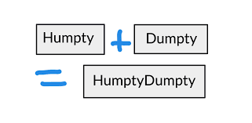
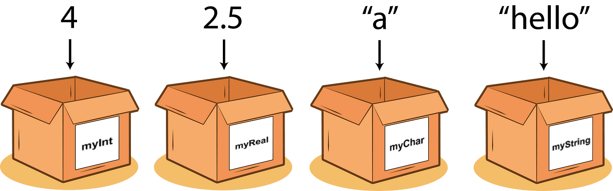

# First steps in Python

## Preface

To be most efficient in learning this matter, I advise you to copy the code, run it and fiddle with it, see what works
and what doesn't.

> All the code below can be ran independently.


## Example code

Let's start with a little piece of code from the last lesson.

```python
name = "Marius"
hello_string = "Hello " + name
print(hello_string)
```

In this small program:

1. We start by assigning the value "Marius" to a variable called `name`.
    * This tells the computer to remember that `name` is `Marius`. Note that the `"` (quotes) denote that it is a
      string.
2. We create another variable called `hello_string`, which combines the string "Hello " with the value stored in
   the `name` variable.
    * In programming, we can use a variable, to access the value it holds. The `name` variable currently holds `Marius`,
      to the computer `name` and `Marius` are the same.
    * The `+` (plus) operator, when applied on strings will connect the two strings together.
    * 

3. Finally, we use the `print()` function to display the value of the `hello_string` variable on the screen. In this
   case, it will print "Hello Marius" because the value of `name` is "Marius". So, when the code is run, it will output
   the greeting message `"Hello Marius"` to the console.

## What are variables

In programming, a variable is like a container that holds a value. You can think of it as a labeled box where you can
store different things. Each variable has a name that you choose, and you can assign a value to it.

For example, imagine you have a variable called `score`. You can use this variable to store the score you achieved in a
game. Initially, the variable might have a value of 0. As you play the game and earn points, you can update the value of
the `score` variable to reflect your new score.

Variables are useful because they allow you to store and manipulate data in your program. You can perform operations on
variables, like adding them together or changing their values based on certain conditions.



## How to declare variables

In Python, you can declare a variable by following these rules:

1. Choose a name for your variable: The name should be meaningful and describe the purpose of the variable. It can
   contain letters (both uppercase and lowercase), digits, and underscores (_), but it must start with a letter or an
   underscore. Avoid using special characters or spaces in variable names.

```python
first_name = 'valid'
FIRST_NAME = 'valid'
_firt_name_ = 'valid'
__first_name = 'valid'
$amount = 'not valid'
1
_name = 'not valid'
v4r_name = 'valid but not recomended'
```

> This code is broken...

2. Use the assignment operator (=) to assign a value to the variable: After choosing the name, you can use the
   assignment operator to assign a value to the variable. The value can be a number, a string, a boolean (True or
   False), or any other data type.

Here's an example that declares and assigns values to variables in Python:

```python
# Declaring and assigning values to variables
name = "John"  # Assigning a string value
age = 25  # Assigning an integer value
is_student = True  # Assigning a boolean value

# Printing the values of variables
print(name)
print(age)
print(is_student)
```

In the above example, we declare three variables: `name`, `age`, and `is_student`. We assign the string "John" to
the `name` variable, the integer 25 to the `age` variable, and the boolean value True to the `is_student` variable.
Finally, we use the `print()` function to display the values of the variables on the screen.

Remember that in Python, variables are dynamically typed, which means you don't need to explicitly declare the type of a
variable. The type is inferred based on the value assigned to it.

### Chained assignment

We can also **chain** assign variables. Let's say our program starts with two values that are equal to the same value.

x is equal to 10 and y is also equal to 10.

We can write it in python as follows:

```python
# Do this
x = y = 10
# Instead of this
x = 10
y = 10
```

**Note:** that this is only useful in situations where you have more than one variable that have the same value.

## What are constants

In Python, constants are similar to variables, but their values cannot be changed once they are assigned. They are used
to represent fixed values that remain constant throughout the program.

Although Python doesn't have built-in support for constants, developers often use naming conventions to indicate that a
variable's value should be treated as a constant and not modified. By convention, constant names are typically written
in uppercase letters with underscores between words to improve readability.

For example, let's say we want to define a constant for the value of pi (π) in our program. We can assign a value to a
variable named `PI` and treat it as a constant:

```python
PI = 3.14159
```

Once the value is assigned to `PI`, it should not be changed elsewhere in the code. By convention, other programmers who
work with the code should understand that `PI` is intended to be treated as a constant and avoid modifying it.

It's **important** to note that Python **does not** enforce the immutability of variables marked as constants. The
naming convention serves as a guideline for programmers to indicate that the value should not be modified, but it's
still possible to change the value if desired. Therefore, it's up to the developers to follow best practices and treat
these variables as constants by not modifying their values during the program's execution.

## Comments

Comments are pieces of text left near or next to code, usually used to explain what a piece of code does. Python will
not process the comments, as the comments are intended for developers and not for the computer. Any piece of code that
stars with `#` will not be executed.

> Using comments is useful also when you want to avoid executing a line, but want to keep it in "just in case you need
> it".

Comments in python always start with `#`. This means that any line that starts with `#` is trated as a comment.

## What are functions

Functions allow you to encapsulate reusable pieces of code and execute them whenever needed. In other words, functions
are sets of instructions and algorithms that can be executed when necessary. Functions follow the pattern of
**Input** -> **Processing** -> **Output**.

The process of **executing** a function is called **function calling.**

When calling a function, you are telling Python to execute the code inside that function.

Here are the key points to understand about calling functions in Python:

1. **Function name**: To call a function, you need to know its name. Functions in Python are typically defined with a
   name followed by parentheses, like `function_name()`. The function name should match the name used when the function
   was defined.

2. **Parentheses**: The parentheses `()` are essential when calling a function. They serve to indicate that you want to
   execute the function rather than just referring to its name. Even if the function doesn't take any arguments, you
   still need to include the parentheses.

3. **Arguments**: Functions can accept **input** values called **arguments** or **parameters**. When calling a function,
   you can provide values for these arguments inside the parentheses. For example, if a function expects a number as an
   argument, you would pass the number inside the parentheses when calling the function, like this`function_name(5)`.
    * Example: The `print` function takes a string as an arugment `print('my_string')`

4. **Return value**: Functions can also return a value as a result of their execution (the **Output**). When calling a
   function that returns a value, you can assign the result to a variable or use it directly in your code. For
   example, `result = function_name()` or `print(function_name())`.

5. **Function execution**: When a function is called, Python executes the code inside the function. It jumps to the
   function's definition, runs the code within the function block, and then returns to where the function was called.

6. **Nested function calls**: Functions can be called from within other functions. This allows you to build more complex
   programs by breaking down tasks into smaller, manageable functions and calling them as needed.

## The print function

The `print()` function in Python is used to display messages or results on the console. It is one of the simplest and
most frequently used functions in Python, especially during the development and debugging stages of programs. Here are
some important aspects to understand about the `print()` function:

- **Printing a simple message**: The simplest way to use the `print()` function is to provide a string of characters
  within the parentheses. This string represents the message you want to display. For example, `print("Hello, world!")`
  will display "Hello, world!" on the console.

- **Printing variable values**: You can display the values of variables within the `print()` function using
  concatenation or string formatting. For example:

```python
name = "Alice"
age = 25
print("Name: " + name + ", Age: " + str(age))
```

This will display `"Name: Alice, Age: 25"` in the console.

- **Printing multiple elements**: The `print()` function can receive multiple arguments separated by commas. These
  arguments will be displayed in the order they are specified, separated by spaces. For
  example, `print("Python", "is", "awesome!")` will display `"Python is awesome!"` on the console.

The `print()` function will be the most frequently used function by you, so it's good to get familiar with it in more
depth by following [this link.](https://www.geeksforgeeks.org/python-print-function/)

## What are types

In Python, types refer to the classification or category of data that a variable can hold. Each variable has a specific
type that determines the kind of data it can store and the operations that can be performed on it. Let's discuss four
commonly used types in Python: `str` (string), `int` (integer), `float` (floating-point number), and `bool` (boolean).

1. **String (`str`)**: A string is a sequence of characters enclosed in quotation marks (`'` or `"`). It is used to
   represent text. For example: `"Hello, World!"` or `'Python Programming'`. Strings can be manipulated using various
   operations like concatenation (joining), slicing (extracting parts), and more.

2. **Integer (`int`)**: An integer represents a whole number without any decimal places. For example: `5`, `-10`, `0`.
   Integers are used in mathematical calculations and can be added, subtracted, multiplied, divided, and so on.
    * > If a number is enclosed in quotes (e.g `"10"` or `"15.1"`) it is not treated by python as a number, but as a
      string.

3. **Float (`float`)**: A float represents a decimal number. It contains a decimal point and can have fractional parts.
   For example: `3.14`, `1.5`, `-0.5`. Floating-point numbers are used in calculations involving real numbers.

4. **Boolean (`bool`)**: A boolean represents a logical value and can have either `True` or `False` as its value.
   Booleans are often used in conditional statements and comparisons. For example: `True` and `False`. Booleans can also
   be the result of comparison operations, such as `==` (equality), `>` (greater than), `<` (less than), etc. Please
   note that booleans are case-sensitive, this means that `true` and `false` are not valid, only `True` and `False`.

5. `None`: A special data type, that is used to signify that there is no value.

Here's an example that demonstrates the use of these types:

```python
name = "John"  # String
age = 25  # Integer
height = 1.75  # Float
is_student = True  # Boolean
nothing = None  # None

print(name)
print(type(name))  # Should be str
print(age)
print(type(age))  # Should be int
print(height)
print(type(height))  # Should be float
print(is_student)
print(type(is_student))  # Should be bool
```

In this example, we have variables with different types. `name` is a string, `age` is an integer, `height` is a float,
and `is_student` is a boolean. We use the `print()` function to display the values of these variables on the screen.

## Dynamic Typing

Dynamic typing is a feature of Python that allows variables to hold values of any type, and the type of a variable can
be changed dynamically during the execution of a program. In dynamically typed languages like Python, you don't need to
explicitly declare the type of a variable before assigning a value to it.

Here's how dynamic typing works in Python:

1. Type Inference: When you assign a value to a variable, Python automatically determines the type based on the value
   assigned. For example:

```python
x = 5  # x is an integer
y = "Hello"  # y is a string
```

In this example, `x` is inferred as an integer because the value assigned is an integer, and `y` is inferred as a string
because the assigned value is a string.

2. Dynamic Type Change: Once a variable is assigned a value, you can later assign a value of a different type to the
   same variable without any issues. Python allows you to change the type of a variable on the fly. For example:

```python
x = 5  # x is an integer
x = "Hello"  # x is now a string
```

In this case, `x` starts as an integer, but its type changes to a string when a new value is assigned. Python handles
the type conversion automatically.

```python
x = 5
y = "Hello"
result = x + y  # This operation will raise a TypeError
```

In this example, adding an integer (`x`) and a string (`y`) would result in a TypeError because these types are not
compatible for addition. Python performs type checking during execution to ensure that operations are valid for the
types involved.

Dynamic typing in Python offers flexibility by allowing variables to hold values of different types and enabling easy
reassignment of values. However, it's important to keep track of the types of variables and be mindful of potential
type-related errors that can occur if operations are not compatible with the current type of a variable.

## Declaring Strings (str)

In Python, you can declare strings by enclosing them in either single quotes (`'`) or double quotes (`"`). Here are a
few examples:

```python
# Declaring strings using single quotes
string1 = 'Hello, World!'
string2 = 'This is a string.'

# Declaring strings using double quotes
string3 = "Python programming"
string4 = "I love coding!"

# Declaring strings with quotes inside
string5 = "He said, 'Hello!'"
string6 = 'She replied, "Hi there!"'
```

In the examples above, `string1` and `string2` are declared using single quotes, while `string3` and `string4` are
declared using double quotes. Both ways are valid, and you can choose whichever you prefer.

If you need to include quotes inside a string, you can use one type of quotes to enclose the entire string and the other
type of quotes inside the string. For example, `string5` uses double quotes to enclose the string and single quotes
inside, and `string6` does the opposite.

Python treats single-quoted strings and double-quoted strings the same way. You can perform various operations on
strings, such as concatenation, slicing, length calculation, and more. Strings are versatile and commonly used to store
and manipulate text-based data in Python programs.

## Basic String operations - Concatination

In Python, you can perform various string operations to manipulate and combine strings. One of the fundamental string
operations is concatenation, which allows you to combine multiple strings into a single string. Here's how concatenation
works in Python:

To concatenate strings, you can use the `+` operator. It works by simply adding two or more strings together. Here's an
example:

```python
string1 = "Hello"
string2 = "World"
result = string1 + string2
print(result)
```

In the above example, the variables `string1` and `string2` hold the strings "Hello" and "World" respectively. By using
the `+` operator, we concatenate these two strings together and store the result in the `result` variable. Finally, we
use the `print()` function to display the concatenated string, which will output "HelloWorld".

You can also concatenate strings with **literal values** or **variables**. Here's an example that demonstrates both
cases:

> Literal values: Values explicitly written in code and not stored in variables: `a = 10` is a variable, `10` is a
> literal.

```python
name = "Alice"
greeting = "Hello, " + name + "!"
print(greeting)
```

In this example, the variable `name` holds the string "Alice". We then concatenate it with the strings "Hello, " and "!"
to create the greeting message. The result is stored in the `greeting` variable and printed using the `print()`
function. The output will be "Hello, Alice!".

Additionally, you can concatenate strings multiple times by using the `*` operator. This repeats the string a specified
number of times. Here's an example:

```python
message = "Hi! " * 3
print(message)
```

In this example, the string "Hi! " is repeated three times using the `*` operator. The resulting string, "Hi! Hi! Hi!",
is stored in the `message` variable and printed.

Concatenation allows you to combine strings in various ways, enabling you to create dynamic and customized messages in
your programs.

## Numeric types

In Python, you can declare floats (floating-point numbers) and integers using simple assignment statements. Here's how
you can declare them:

1. **Floats**:
   To declare a float, you can directly assign a decimal value to a variable. For example:

   ```python
   # Declaring floats
   float_num1 = 3.14
   float_num2 = 2.5
   ```

   In the above example, `float_num1` and `float_num2` are variables that hold float values.

2. **Integers**:
   To declare an integer, you can assign a whole number (without decimal places) to a variable. For example:

   ```python
   # Declaring integers
   int_num1 = 10
   int_num2 = -5
   ```

   In the above example, `int_num1` and `int_num2` are variables that store integer values.

Python automatically determines the type of the variable based on the value assigned to it. So, there's no need to
explicitly specify the type as you would in some other programming languages.

It's important to note that you can perform mathematical operations on both floats and integers. If you perform an
operation between an integer and a float, Python automatically promotes the integer to a float to preserve the decimal
part in the result. For example:

```python
x = 10  # integer
y = 3.14  # float

result = x + y  # The result will be a float: 13.14
```

In the above example, even though `x` is an integer and `y` is a float, the addition operation promotes `x` to a float
before adding it to `y`.

## Basic arithmetic operations in python

In Python, the basic arithmetic operations are performed using the following operators:

1. Addition (+): The addition operator is represented by the plus symbol (+). It is used to add two or more numbers
   together. For example:

   ```python
   a = 5
   b = 3
   result = a + b  # Result is 8
   ```

2. Subtraction (-): The subtraction operator is represented by the minus symbol (-). It is used to subtract one number
   from another. For example:

   ```python
   a = 5
   b = 3
   result = a - b  # Result is 2
   ```

3. Multiplication (*): The multiplication operator is represented by the asterisk symbol (*). It is used to multiply two
   or more numbers. For example:

   ```python
   a = 5
   b = 3
   result = a * b  # Result is 15
   ```

4. Division (/): The division operator is represented by the forward slash symbol (/). It is used to divide one number
   by another. By default, division in Python returns a float result. For example:

   ```python
   a = 10
   b = 3
   result = a / b  # Result is 3.3333333333333335
   ```

   If you want to perform integer division and get the quotient as an integer, you can use the double forward slash
   operator (//). For example:

   ```python
   a = 10
   b = 3
   result = a // b  # Result is 3
   ```

   In this case, the decimal part of the division result is truncated, and only the integer quotient is returned.

These are the basic arithmetic operations in Python. They allow you to perform addition, subtraction, multiplication,
and division on numeric values. Additionally, Python also provides other arithmetic operators such as the modulus
operator (%) for obtaining the remainder of a division and the exponentiation operator (**) for raising a number to a
power.

## String formatting in Python

String formatting in Python refers to the process of creating strings by incorporating variable values,
expressions, and other elements into a string. It allows you to create dynamic strings that can be customized based on
the values of variables or other information. Python provides two main methods for string formatting: f-strings (
formatted string literals) and the `.format()` method.

1. **F-strings (Formatted string literals):**
   F-strings provide a concise and expressive way to format strings in Python. They were introduced in Python 3.6 and
   later versions. With f-strings, you can embed expressions and variables directly within a string by prefixing it with
   the letter 'f' or 'F'. Here's an example:

   ```python
   name = "Alice"
   age = 25
   message = f"My name is {name} and I am {age} years old."
   print(message)
   # My name is Alice and I am 25 years old.
   ```

   In this example, the f-string is defined by prefixing the string with 'f'. Inside the curly braces `{}`, you can
   include variable names or expressions enclosed in curly braces. The expressions are evaluated at runtime, and their
   values are inserted into the string.

2. **The `.format()` method:**
   The `.format()` method is a versatile and flexible way to format strings in Python. It allows you to specify
   placeholders within a string using curly braces `{}` and pass values to those placeholders using the `.format()`
   method. Here's an example:

   ```python
   name = "Alice"
   age = 25
   message = "My name is {} and I am {} years old.".format(name, age)
   print(message)
   ```

   In this example, the curly braces `{}` act as placeholders in the string. The `.format()` method is called on the
   string object and passed the values `name` and `age`. These values are then inserted into the placeholders in the
   order they are passed.

Both f-strings and the `.format()` method provide powerful string formatting capabilities. They allow you to include
variables, expressions, and even specify formatting options for the values being inserted. Choosing between f-strings
and `.format()` method depends on personal preference and the Python version you are using.

## None

In Python, `None` is a special constant that represents the absence of a value or the lack of a specific object. It is
often used to indicate that a variable or expression does not have a meaningful or defined value.

Here are some key points about `None` in Python:

1. **Representation of absence**: `None` serves as a placeholder to denote the absence of a value. It is commonly used
   when a variable or function doesn't return any specific result or when the value is yet to be determined.

5. **Initializing variables**: `None` can be assigned to a variable as an initial value when you want to indicate that
   it has not been assigned a specific value yet. This is often done as a placeholder until a meaningful value is
   assigned later.

It's important to note that `None` is not the same as an empty string (`''`), zero (`0`), or a boolean value
like `False`. It specifically represents the absence of a value or the lack of a specific object rather than having a
specific value or meaning.

## Input function in Python

The `input()` function in Python is used to allow user input during the execution of a program. It enables the program
to pause and wait for the user to enter some text or value from the keyboard.

When the `input()` function is called, the program **will pause** and **wait** for the user to enter text. The function
will
display a prompt, which is the string provided as an argument to the `input()` function. The user can then type their
input and press the Enter key.

Here's an example that demonstrates the use of the `input()` function:

```python
name = input("Enter your name: ")
print("Hello, " + name + "! Welcome to the program.")
```

In this example, the program prompts the user to enter their name by displaying the message "Enter your name: ".
The `input()` function is called with this message as an argument. When the user enters their name and presses Enter,
the program proceeds to the next line.

The input provided by the user is stored in the variable `name`. The program then uses the entered name to display a
personalized greeting message using string concatenation. Finally, the message is printed using the `print()` function.

It's important to note that the `input()` function treats all user input as strings, regardless of what is entered. If
you need to perform calculations or comparisons with the input as numbers, you may need to convert the input to the
appropriate data type using functions like `int()` or `float()`.

The `input()` function is a useful tool for creating interactive programs that can accept user input and respond
accordingly.
