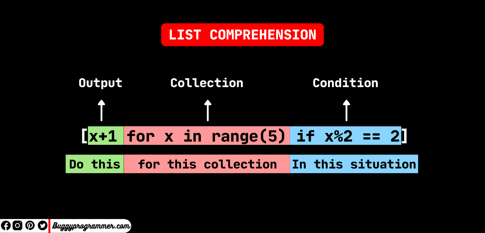

## Using `break` and `continue` in Loops: Enhancing Control Flow in Python

Python provides the `break` and `continue` statements as powerful tools to control the flow of execution within loops.
Whether you are working with a `while` loop or a `for` loop, these statements allow you to modify the loop's behavior
based on specific conditions, improving efficiency and flexibility in your code.

## The `break` Statement: Breaking Out of Loops

The `break` statement is used to exit a loop prematurely. When encountered within a loop, it immediately terminates the
loop's execution and transfers control to the next statement outside the loop.

### Using `break` with `while` Loops

In the case of a `while` loop, the `break` statement allows you to exit the loop before the condition for continuation
becomes false. This can be particularly useful when you want to stop the loop based on certain criteria.

Consider the following example:

```python
count = 0
while count < 10:
    if count == 5:
        break
    print(count)
    count += 1
```

In this code snippet, the `while` loop continues as long as the value of `count` is less than 10. However, when `count`
reaches 5, the `break` statement is encountered, causing the loop to terminate prematurely. As a result, the program
directly proceeds to the next statement after the loop.

### Using `break` with `for` Loops

Similarly, the `break` statement can also be used with `for` loops to exit the loop prematurely. It provides a way to
break out of the loop based on certain conditions.

Consider the following example:

```python
fruits = ['apple', 'banana', 'orange', 'grape', 'watermelon']
for fruit in fruits:
    if fruit == 'orange':
        break
    print(fruit)
```

In this code snippet, the `for` loop iterates over the elements of the `fruits` list. However, when the loop encounters
the string `'orange'`, the `break` statement is triggered, causing the loop to terminate immediately. The program then
continues executing the next statement after the loop.

### When is breaking useful

Breaking is useful in many scenarios, but most often, I think about using break when I want to optimize the flow of my
while loop.

Consider the following example:

```python
from time import sleep
from random import randrange

while True:
    # Random number is used to "ilustrate a message from somewhere externally"
    random_number = randrange(0, 10)
    if random_number == 1:
        print("Received the message we expected")
        break
    # The message was not received
    # Wait a bit before requesting or proecessing a new message
    sleep(1)

# Alternative, without break

message_received = False
while not message_received:
    # Random number is used to "ilustrate a message from somewhere externally"
    random_number = randrange(0, 10)
    if random_number == 1:
        print("Received the message we expected")
        message_received = True
    # Not using else here will make us wait one more second before finishing the loop
    else:
        # The message was not received
        # Wait a bit before requesting or proecessing a new message
        sleep(1)

```

In the example above, two things spring to mind. The first one is that our loops **exit condition** is declared
differently.

In the second example, our loop is controlled by the boolean value of `message_received` and in the first one, the flow
is
entirely controlled by the `break` statement.

The second thing is that due to the lack of the `break` statement in the second example, and the reliance solely on the
boolean condition, makes it so we **MUST** specify an `else` block, to avoid sleeping 1 second after the message was
received. The `break` statement in the first example, allows us to exit immediately.

In this example alone, this would not be a problem, but if we have more processing to do in the `else` block, the code
will become messy.

Here is another example where this becomes apparent:

```python
# A program that checks if a number is prime, user has a limit of numbers to check 
limit = 5
while True:
    question = input('Enter a number you want to check for prime or write "stop" to close the program: ')
    if question.lower() == 'stop':
        # This breaks the `while` loop preventing any of the code lower to run
        break
    number = int(question)
    if number < 2:
        print('Invalid operation for numbers lower than 1')
    prime = True
    for a in range(2, number // 2 + 1):
        if number % a == 0:
            prime = False
            # This only breaks the `for` loop and not the `while` loop.
            break
    if prime:
        print("Number is prime")
    else:
        print("Number is not prime")
```

Note in the example above, we have two separate breaks, one inside the `while` loop, and the second one inside the `for`
loop. The `break` statement can only affect the loop it is included in, and in our case, the `break` inside the `for`
loop can only affect the `for` loop and it can never affect the `while` loop.

If you try to change the code above (**seriously, try it!**) to not use the break to stop the loops, and use the if/else
structures and the boolean condition, you will find that the code becomes less readable.

The `break` statement is essential for control-flow, especially in situations where the code inside the loop is complex
and long.

> **Import Note**: Using break does not mean you are not allowed to use a boolean condition for the while. You can
> combine them to create more complex structures.

## The `continue` Statement: Skipping Iterations

The `continue` statement allows you to skip the rest of the current iteration and proceed to the next iteration of a
loop. It is particularly useful when you want to bypass certain iterations based on specific conditions.

### Using `continue` with `while` Loops

In a `while` loop, the `continue` statement enables you to skip the remaining code in the current iteration and move to
the next iteration, without executing the subsequent statements.

Consider the following example:

```python
count = 0
while count < 5:
    count += 1
    print(f'Iteration nr {count}')
    if count == 3:
        continue
    print(f"End of iteration nr {count}")
# Iteration nr 1
# End of iteration nr 1
# Iteration nr 2
# End of iteration nr 2
# Iteration nr 3
# Iteration nr 4
# End of iteration nr 4
# Iteration nr 5
# End of iteration nr 5
```

In this code snippet, the `while` loop continues as long as the value of `count` is less than 5. However, when `count`
equals 3, the `continue` statement is encountered. As a result, the remaining code within the current iteration is
skipped, and the loop proceeds to the next iteration, thus skipping the End of the iteration.

### Using `continue` with `for` Loops

Similarly, the `continue` statement can be used with `for` loops to skip the remaining code in the current iteration and
move on to the next iteration.

Consider the following example:

```python
fruits = ['apple', 'banana', 'orange', 'grape', 'watermelon']
for fruit in fruits:
    if fruit == 'orange':
        continue
    print(fruit)
```

In this code snippet,

the `for` loop iterates over the elements of the `fruits` list. However, when the loop encounters the string `'orange'`,
the `continue` statement is triggered. As a result, the remaining code within that iteration is skipped, and the loop
proceeds to the next iteration.

### Enhancing Control Flow with `break` and `continue`

The `break` and `continue` statements provide essential control flow mechanisms in Python loops. By strategically using
these statements, you can efficiently control the loop's execution, terminate loops prematurely when necessary, and skip
iterations based on specific conditions.

Whether you're working with a `while` loop or a `for` loop, incorporating `break` and `continue` statements into your
code can significantly enhance its flexibility and efficiency. These powerful tools empower you to fine-tune the
behavior of your loops, making your code more concise, readable, and effective.

## Unveiling the Beauty of List Comprehension



Ah, list comprehensions—a beloved feature among Python developers (and perhaps everyone else too). They offer a compact
and elegant syntax for performing actions on a list of items. List comprehensions can be seen as a concise way to create
new lists by transforming or filtering existing ones.

Let's dive into a demonstration to showcase their power:

```python
some_numbers = [1, 2, 3, 4, 5]
numbers_doubled = [number * 2 for number in some_numbers]
print(numbers_doubled)  # [2, 4, 6, 8, 10]
```

In the above code snippet, a new list called `numbers_doubled` is created using list comprehension. It achieves the same
result as the more verbose alternative that uses a traditional for loop:

```python
some_numbers = [1, 2, 3, 4, 5]
numbers_doubled = []
for number in some_numbers:
    numbers_doubled.append(number * 2)
print(numbers_doubled)  # [2, 4, 6, 8, 10]
```

> Note: The example above, and the one before it do exactly the same.

The concise nature of list comprehensions is impressive, allowing you to accomplish the same task with fewer lines of
code without sacrificing clarity.

Nested Comprehensions? Sure, why not!

```python
number_box_1 = [1, 2, 3]
number_box_2 = [4, 5, 6]
numbers_combined = [n_1 * n_2 for n_1 in number_box_1 for n_2 in number_box_2]
print(numbers_combined)  # [4, 5, 6, 8, 10, 12, 12, 15, 18]
```

List comprehensions provide the flexibility to nest them within each other. This feature enables the creation of
powerful combinations, opening up a world of possibilities for transforming and manipulating data.

## Practical Applications

Now that we have explored the elegance of list comprehensions, let's delve into some useful scenarios where they truly
shine.

### Extracting Data from a List of Lists

Consider a scenario where you have a list of student records, where each record is represented as a list containing the
name, age, and gender of a student. Suppose you only want to extract the names from this list. Here's how list
comprehension comes to the rescue:

```python
students = [
    ['Andrei', 22, 'M'],
    ['Cristina', 35, 'F'],
    ['Victor', 18, 'M']
]

student_names = [student[0] for student in students]
```

With a simple list comprehension, you effortlessly obtain a new list, `student_names`, containing only the names
extracted from the original list of lists. This concise approach saves you from writing lengthy loops or using other
methods to achieve the same result.

### Conditional List Comprehension

List comprehensions also support conditional expressions, allowing you to filter elements based on specific conditions.
By utilizing the **if** statement within a list comprehension, you can selectively include or exclude items from the
resulting list.

Let's take a look at an example to illustrate this:

```python
numbers = [1, 2, 5, 20, 28, 37, 54, 29, 300]
odd_numbers = [number for number in numbers if number % 2 == 1]
print(odd_numbers)  # Prints [1, 5, 37, 29]
```

In this case, the resulting list, `odd_numbers`,
only contains the odd numbers from the original list, thanks to the conditional expression `number % 2 == 1`.
The elements that satisfy the condition are included in the new list, while the others are excluded.

It's worth noting that unlike traditional if statements, list comprehensions lack an **else** or **elif** clause. They
are specifically designed for concise filtering and transformation operations. However, their concise nature and
expressive power make them a go-to tool for many Python developers.

List comprehensions offer an elegant solution for various scenarios, allowing you to write more concise and readable
code. Once you grasp their concept, you'll find yourself reaching for this powerful tool time and time again, enhancing
your productivity and making your code more expressive.
