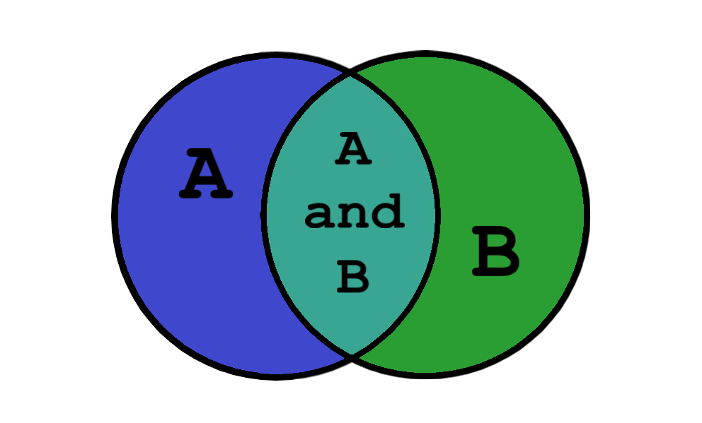
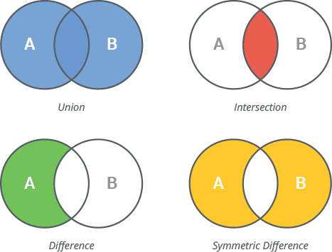

## Tuple

### What are tuples

In Python, a tuple is an ordered collection of elements, similar to a list. However, tuples are immutable, which means
they cannot be modified after creation. Tuples are defined using parentheses `()` or the `tuple()` constructor.

Here's an example of creating a tuple:

```python
my_tuple = (1, 2, 3)
```

Tuples can contain elements of different data types, such as numbers, strings, or even other tuples.

### Tuples are immutable

Unlike lists, tuples are immutable, meaning their elements cannot be changed once assigned. This immutability provides
some advantages, such as guaranteeing the integrity of the data and making tuples suitable for storing constant values
or data that should not be modified.

```python
my_tuple = (1, 2, 3)
my_tuple[0] = 4  # Raises a TypeError: 'tuple' object does not support item assignment
```

This means that you can not **add**, **remove** or **change** elements inside a `tuple`.

### How to create tuples

Tuples can be created in many ways:

* from a tuple literal
* using comma separated values
* items can be converted to a tuple from another iterable

```python
# Tuple literal
my_tuple = ('one', 'two')
# Comma separated
also_tuple = 'one', 'two'
# Also tuple, but from a list
students = ['Marius', 'John', 'Victor']
students_tuple = tuple(students)

# Build a tuple from a comprehension
even_numbers_until_10000 = tuple(a for a in range(10001) if a % 2 == 0)
```

### When are tuples useful

Tuple is a very basic collection, and can be used everywhere you need to store an **unchangeable** sequence of values.

By unchangeable, it is meant, that the programmer knows ahead of time that the sequence will not be modified, such as
constants.

```python
DAYS_OF_WEEK = ('monday', 'tuesday', 'wednesday', 'thursday', 'friday', 'saturday', 'sunday')

print(DAYS_OF_WEEK[0])
```

Tuples are also **more efficient** than lists in terms of **computer memory**, which means you can store more data, in
less space.

```python
import sys

sys.getsizeof(['a'] * 10000)  # Size of a list of 10000 elements
# 80056 bytes
sys.getsizeof(('a') * 10000)  # Size of a tuple of 10000 elements
# 10049 bytes (almost 8 times less)
```

This means that if you don't plan on changing the data read from a file, or from a large dataset, it is best to store it
in a tuple.

### Tuple methods

Tuples in Python provide a few built-in methods for various operations:

- `count(element)`: Returns the number of occurrences of a specific element in the tuple.
- `index(element)`: Returns the index of the first occurrence of a specific element in the tuple.

```python
my_tuple = (1, 2, 2, 3, 3, 3)

count_2 = my_tuple.count(2)
print(count_2)  # Output: 2

index_3 = my_tuple.index(3)
print(index_3)  # Output: 3
```

Tuples also have the usual properties, such as `len`, and they as any other **sequence** support **slicing** and
**indexing**.

## Tuple operations (Comparison, Addition, and Multiplication)

Tuples support several boolean and _mathematical_ operators.

### Comparison

Tuples can be compared using the comparison operators (`<`, `<=`, `>`, `>=`, `==`, `!=`) based on their elements' values
and order.

```python
tuple1 = (1, 2)
tuple2 = (3, 4)

print(tuple1 < tuple2)  # Output: True
print(tuple1 == tuple2)  # Output: False
```

By comparing a tuple, you are comparing each individual value in the tuple until a **winner** is decided.

Please note that the individual values inside the tuple must be of the same type.

```python
a = ('1', '2', '3')
b = (1, 2)
a > b  # This will be a TypeError
```

> Note: code above raises TypeError

When comparing tuples of the same type and **the same length**, each value is checked against each-other, and whichever
value matches the condition first, is the "winner". By this logic `(6,2,3)` is smaller than `(5, 100, 2000)` because
when checking the first values `6` and `5`, the former is larger.

When comparing different lengths, the same logic applies, however if all the values are the same, the longer value
always **wins**.

### Addition/Concatenation

Tuples can be concatenated using the `+` operator, creating a new tuple that combines the elements of both tuples.

```python
tuple1 = (1, 2)
tuple2 = (3, 4)

tuple3 = tuple1 + tuple2
print(tuple3)  # Output: (1, 2, 3, 4)
```

### Multiplication

Tuples can be multiplied by an integer to create a new tuple with repeated elements.

```python
my_tuple = (1, 2)

new_tuple = my_tuple * 3
print(new_tuple)  # Output: (1, 2, 1, 2, 1, 2)
```

## Tuple slicing and indexing

Similar to lists, tuples support indexing and slicing to access specific elements or subsequences.

```python
my_tuple = (1, 2, 3, 4, 5)

print(my_tuple[0])  # Output: 1
print(my_tuple[1:4])  # Output: (2, 3, 4)
print(my_tuple[-1])  # Output: 5
```

The indexing starts at 0, where the first element has an index of 0. Negative indices count from the end of the tuple.

## Set

A set is an unordered collection of unique elements in Python. Sets are defined using curly braces `{el1, el2}` or
the `set()` constructor.



Sets in Python, are also very close to mathematical sets.

> Note: Using curly brackets is **only allowed** for **NON-EMPTY** sets: `{1,2,3}` - is a set, `{}` - is a dict.

Here's an example of creating a set:

```python
my_set = {1, 2, 3}
print(my_set)  # {1, 2, 3}
another_set = {2, 4, 2}
print(another_set)  # {2, 4}
```

Sets can only contain **unique** elements, and duplicate values are **automatically eliminated**.

Python set is mutable, meaning that after you create a set, you can remove and add elements to/from it, as you would do
with a list.

### Why use sets ?

* Sets can be used to store values when you want to make sure they don't repeat.
* Sets can also be used when you want to do one or more of sets operations with some elements.

### Set methods (addition and removal)

Sets provide various methods to add and remove elements:

- `add(element)`: Adds a single element to the set. **Different from lists `append` method**
- `update(iterable)`: Adds multiple elements from an iterable (e.g., list, tuple) to the set.
- `remove(element)`: Removes a specific element from the set. Raises a KeyError if the element is not found.
- `discard(element)`: Removes a specific element from the set if it exists. No error is raised if the element is not
  found.

```python
my_set = {1, 2, 3}

my_set.add(4)
print(my_set)  # Output: {1, 2, 3, 4}

my_set.remove(2)
print(my_set)  # Output: {1, 3, 4}

my_set.discard(5)  # No error raised if the element doesn't exist
```

### Set methods (comparison)

Sets in Python provide comparison methods to check for equality, subset, and superset relationships:

- `x1.issubset(x2)`: Checks if the set is a subset of `x2` - If all elements of `x1` are present in `x2`
- `x1.issuperset(x2)`: Checks if the set is a superset of `x2` - If all elements of `x2` are present in `x1`.
- `x1.isdisjoint(x2)`: Checks if the set has no common elements with `x2`.
- `x1 == x2`: Checks if the set contains all the same elements as `x2`

```python
set1 = {1, 2, 3}
set2 = {1, 2, 3, 4, 5}
set3 = {4, 5, 6}
set4 = {3, 2, 1}

print(set1 == set2)  # Output: True
print(set1.issubset(set2))  # Output: True
print(set2.issuperset(set1))  # Output: True
print(set1.isdisjoint(set3))  # Output: True
```

### Set methods (union, difference, intersection)



Sets in Python provide additional methods to perform set operations such as union, difference, and intersection.

- `union(other_set)`: Returns a new set containing all elements from both sets.
- `difference(other_set)`: Returns a new set with elements that are in the first set but not in the second set.
- `intersection(other_set)`: Returns a new set containing common elements between two sets.

```python
set1 = {1, 2, 3}
set2 = {3, 4, 5}

union_set = set1.union(set2)
print(union_set)  # Output: {1, 2, 3, 4, 5}

difference_set = set1.difference(set2)
print(difference_set)  # Output: {1, 2}

intersection_set = set1.intersection(set2)
print(intersection_set)  # Output: {3}
```

These methods return new sets and do not modify the original sets.

### Set methods (union_update, difference_update, intersection_update)

Sets in Python also provide methods that update the set itself based on set operations.

- `update(other_set)`: Updates the set with elements from another set, performing a union.
- `difference_update(other_set)`: Updates the set, removing elements that are present in the other set.
- `intersection_update(other_set)`: Updates the set, keeping only the elements that are also present in the other set.

```python
set1 = {1, 2, 3}
set2 = {3, 4, 5}

set1.update(set2)
print(set1)  # Output: {1, 2, 3, 4, 5}

set1.difference_update(set2)
print(set1)  # Output: {1, 2}

set1 = {1, 2, 3}
set2 = {3, 4, 5}

set1.intersection_update(set2)
print(set1)  # Output: {3}
```

These methods modify the set in place, updating it with the elements based on the set operation. The original set is
changed after these operations.

Understanding these set methods and their behaviors is crucial for effectively working with sets and performing set
operations in Python.

### Set operators

Operations on sets can be achieved both using method calls, but also using operators. Below you will find a list of
supported set operations.

- Union (`|`): Returns a new set containing all elements from both sets.
- Intersection (`&`): Returns a new set containing common elements between two sets.
- Difference (`-`): Returns a new set with elements in the first set but not in the second set.
- Symmetric Difference (`^`): Returns a new set with elements that are in either of the sets but not both.

```python
set1 = {1, 2, 3}
set2 = {3, 4, 5}

union_set = set1 | set2
print(union_set)  # Output: {1, 2, 3, 4, 5}

intersection_set = set1 & set2
print(intersection_set)  # Output: {3}

difference_set = set1 - set2
print(difference_set)  # Output: {1, 2}

symmetric_difference_set = set1 ^ set2
print(symmetric_difference_set)  # Output: {1, 2, 4, 5}
```

### Set usages

Sets can be used in many different scenarios, here are a few examples to get your imagination going.

```python
list_of_grades = ['A', 'C', 'D', 'F', 'A', 'D', 'D', 'C', 'A']

grades_set = set(list_of_grades)
print(grades_set)  # {'D', 'A', 'F', 'C'}
for grade in grades_set:
    print(f"There are {list_of_grades.count(grade)} {grade} in the class.")
# There are 3 D in the class.
# There are 3 A in the class.
# There are 1 F in the class.
# There are 2 C in the class.
```

## Conclusion

Sets and tuples are valuable data structures in Python that offer distinct features and functionalities.

Tuples, being immutable, provide a reliable way to store and access data when you need to ensure its integrity. With
tuple methods and operations like slicing and indexing, you can manipulate and extract information efficiently.

Sets, on the other hand, offer a powerful tool for working with collections of unique elements. They allow you to
perform set operations, such as union, difference, and intersection, providing flexibility in data manipulation. Set
methods and operators further enhance their functionality, allowing you to update sets and compare them easily.

By mastering the concepts and methods related to sets and tuples, you can expand your repertoire of data handling
techniques in Python. Understanding when and how to utilize these structures will empower you to write cleaner, more
efficient code and solve a broader range of problems.
