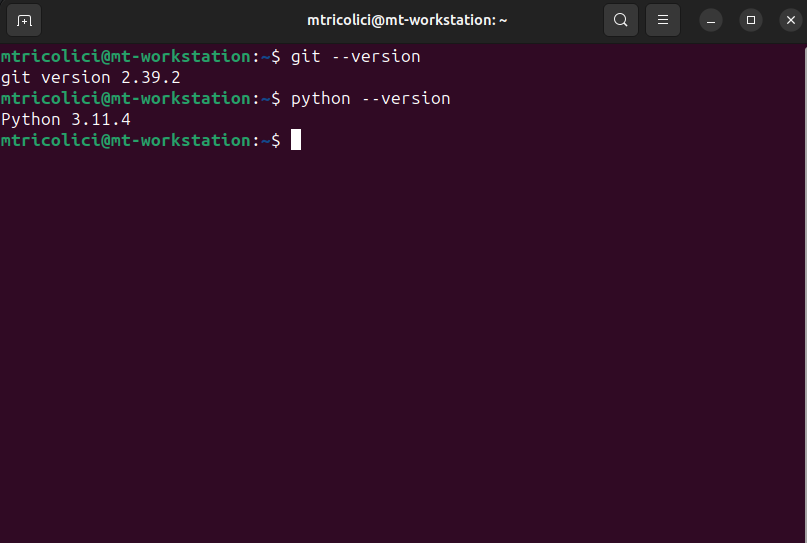

# Setting Up the Working Environment

## Accessing the Terminal (CMD)

> We will need to access and understand the terminal from time to time. Here's how to do it.

Accessing the terminal or command prompt varies depending on the platform you are using. Here are the steps for
accessing the terminal on common platforms:

### 1. **Linux:**

- **Shortcut:**
    - Press `Ctrl + Alt + T` to open a terminal.
- **Alternative:**
    - Use the application menu to find and open the terminal. It might be under "System Tools," "Utilities," or a
      similar category.

### 2. **macOS:**

- **Shortcut:**
    - Press `Command + Space` to open Spotlight, then type "Terminal" and press `Enter`.
- **Alternative:**
    - Navigate to `Applications > Utilities > Terminal` and open it.

### 3. **Windows:**

- **Shortcut:**
    - Press `Win + R` to open the Run dialog, type "cmd" or "powershell," and press `Enter`.
- **Alternative (Windows 10 and later):**
    - Right-click on the Start button, and select "Windows Terminal" or "Command Prompt" / "PowerShell."

## The result

The result should look similar to this, you can run command (e.g. `python --version`) to check if all is set-up
properly.



## Installing Python (3.11) on the Operating System

> Note: Installing any other version is also fine, but the version should not be lower than 3.10.

Installing Python 3.11 on the operating system involves the following steps:

1. Access the official Python website: Open a browser and navigate to the official Python website
   at https://www.python.org/. Make sure to choose the correct version for your operating system (Windows, macOS, or
   Linux).

2. Download the Python installer: Go to the Python 3.11 download page and select the version suitable for your operating
   system. Usually, there are multiple download options, such as the installer for Windows, installation packages for
   macOS, and various options for Linux distributions.

3. Run the Python installer: After downloading the installer, run it to initiate the installation process. During the
   installation, you will be guided by a wizard that prompts you to choose installation options and the location where
   you want to install Python.

4. Configure installation options: During the installation, **you should choose** to add Python to the system path (or
   set the corresponding environment variables) to access Python from any directory in the command line. You can also
   select additional options, such as adding the Python Launcher or standard libraries.
   

5. Complete the installation: After configuring all installation options, click the "Install" or "Next" button to start
   the Python installation. Wait until the installation process is complete.

6. Verify the installation: After a successful installation, you can check if Python 3.11 has been installed correctly.
   Open a terminal window (or command prompt) and type the command `python --version`. If it displays version 3.11, then
   the installation was successful.
   

Now, Python 3.11 should be installed on your operating system, and you are ready to start working with it. You can
create and run Python programs using a text editor or an Integrated Development Environment (IDE) that supports Python.

## Configuring the Development Environment (PyCharm IDE, Community Edition)

Configuring the PyCharm Community Edition development environment involves the following steps:

1. Download and install PyCharm Community Edition: Visit the official PyCharm
   website (https://www.jetbrains.com/pycharm/) and download the free version called PyCharm Community Edition, suitable
   for your operating system (Windows, macOS, or Linux). Run the downloaded installer and follow the instructions to
   install PyCharm on your system.

2. Launch PyCharm: After installation, open PyCharm from the Start menu (Windows) or the applications folder (macOS).
   PyCharm will launch, and you'll be greeted with the start screen.

3. Create a new project:
   
   On the PyCharm start screen, you can choose to open an existing project or create a new one. To create a new project,
   select the "Create New Project" option. Choose the location where you want to save the project and configure the
   Python interpreter settings.

4. Configure the Python interpreter:
   
   In the project configuration window, ensure that you have selected the appropriate Python interpreter. If you have
   installed Python 3.11, you can select the Python 3.11 interpreter from the available list. If the Python interpreter
   is not displayed in the list, click the "Show All..." button and select the manually installed Python interpreter.

5. Optional: Configure project settings: Depending on your preferences and requirements, you can configure and customize
   various project settings, such as code formatting style. To access project settings, you can go to "File" -> "
   Settings" (Windows/Linux) or "PyCharm" -> "Preferences" (macOS).

## Downloading and installing GIT

Configuring and installing Git involves several steps. Below are the general steps for installing and configuring Git on
a typical Unix-based system (such as Linux or macOS). For Windows users, the steps are similar, but you may need to
adjust some commands accordingly.

### Installing Git:

1. **Check for Existing Git Installation:**
   Before installing Git, check if it's already installed on your system by running:
   ```bash
   git --version
   ```

2. **Install Git:**
    - **On Linux:**
        - Ubuntu/Debian:
          ```bash
          sudo apt update
          sudo apt install git
          ```
    - **On macOS:**
        - You can use Homebrew:
          ```bash
          brew install git
          ```
    - **On Windows:**
        - Download the installer from [git-scm.com](https://git-scm.com/download/win) and follow the installation
          instructions.

### Configuring Git:

3. **Set User Information:**
    - Configure your name and email, which will be used for identifying your commits:
      ```bash
      git config --global user.name "Your Name"
      git config --global user.email "your.email@example.com"
      ```

5. **Check Configuration:**
    - Verify your Git configuration settings:
      ```bash
      git config --list
      ```

### Verifying Installation:

9. **Verify Git Installation:**
    - After installation and configuration, verify that Git is working correctly:
      ```bash
      git --version
      ```

Now you should have Git installed and configured on your system. You can use it for version control in your projects.
Adjust these steps based on your specific operating system and requirements.
