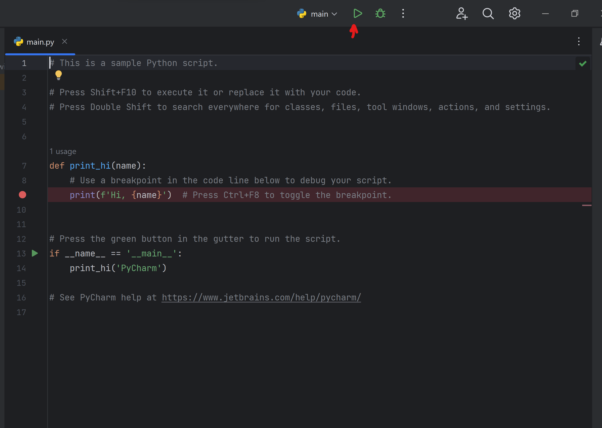
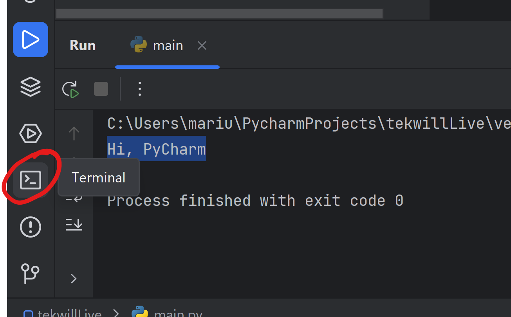

## Ce trebuie să știi despre calculatoare

### Computerele nu sunt inteligente

Tot ce fac calculatoarele este să execute instrucțiuni și, la nivelul lor fundamental, sunt doar "calculatoare"
avansate.


Dar calculatoarele nu pot înțelege oamenii, ele înțeleg doar 0 și 1 `00101001010`. Și ar fi foarte dificil și pentru noi
să înțelegem calculatoarele.

Aici intervin limbajele de programare.

### Calculatoarele execută instrucțiuni, în asta excellează

De-a lungul istoriei, s-a făcut mult dezvoltare atât la nivelul hardware-ului (procesoare, memorie) cât și la nivelul
software-ului.

Cu toate că calculatoarele lucrează folosind doar 0 și 1, acestea pot fi interpretate de calculator ca o serie de
instrucțiuni.

Instrucțiunile cu care lucrează procesoarele tale sunt în mare parte foarte elementare, dar limbajele de programare
furnizează un strat între programator și procesor, pentru a face posibilă dezvoltarea de algoritmi și procese complexe.

## Scopul programării și cum rezolvă problemele

Scopul programării este de a rezolva probleme și de a crea soluții eficiente folosind calculatorul sau mașina.
Programarea oferă posibilitatea de a traduce o problemă complexă într-un set de instrucțiuni clare și precise, cunoscute
sub numele de cod sursă, pe care calculatorul le poate înțelege și executa.

Prin programare, putem rezolva o gamă largă de probleme, inclusiv:

1. **Automatizarea sarcinilor:** Programarea ne permite să automatizăm sarcini repetitive și consumatoare de timp. Putem
   crea programe care efectuează sarcini mecanice, cum ar fi prelucrarea datelor, generarea de rapoarte sau gestionarea
   resurselor, economisindu-ne timpul și efortul.

2. **Manipularea și analiza datelor:** Programarea ne permite să manipulăm și să analizăm cantități mari de date. Putem
   crea algoritmi și programe care sortează, filtrează și extrag informații relevante din seturi mari de date, luând
   decizii informate și descoperind modele sau tendințe ascunse.

3. **Dezvoltarea de aplicații software:** Programarea ne permite să dezvoltăm aplicații software pentru diverse scopuri.
   Putem crea aplicații mobile, aplicații web, programe desktop și altele, oferind funcționalități și servicii utile
   utilizatorilor finali.

4. **Dezvoltarea de site-uri web:** Programarea ne permite să construim site-uri web interactive și dinamice. Putem crea
   pagini web atractive și funcționale folosind limbaje de programare precum HTML, CSS și JavaScript, oferind experiențe
   plăcute utilizatorilor și interacțiuni interactive.

5. **Dezvoltarea de inteligență artificială și învățare automată:** Programarea joacă un rol crucial în dezvoltarea
   tehnologiilor de inteligență artificială și învățare automată. Putem crea algoritmi și modele de învățare automată
   care înțeleg și procesează informații, fac previziuni sau iau decizii pe baza datelor disponibile.

În esență, programarea ne furnizează instrumentele pentru a traduce probleme complexe într-un format pe care
calculatorul le poate înțelege și rezolva. Astfel, putem rezolva diverse probleme și crea soluții inovatoare și
eficiente pentru a satisface nevoile noastre și ale societății în ansamblu.

## Principiile de bază ale programării: Algoritmi, Structuri de date și Controlul fluxului

Principiile de bază ale programării sunt algoritmii, structurile de date și controlul fluxului. Aceste concepte
fundamentale sunt esențiale pentru crearea de programe eficiente și bine structurate. Iată o elaborare asupra fiecărui
principiu:

1. **Algoritmi:**
    - Un algoritm este un set ordonat de pași sau instrucțiuni logice care rezolvă o problemă specifică sau îndeplinesc
      o anumită sarcină.
    - Algoritmii trebuie să fie preciși, neambiți și capabili să rezolve problema eficient.
    - În programare, algoritmii sunt implementați printr-un limbaj de programare și reprezintă o secvență logică de
      instrucțiuni.

2. **Structuri de date:**
    - Structurile de date reprezintă modul în care organizăm și stocăm datele într-un program.
    - Exemple comune de structuri de date includ liste, tablouri, seturi, stive, cozi și arbori.
    - Alegerea unei structuri de date potrivite pentru o problemă dată poate afecta eficiența și performanța
      programului.

3. **Controlul fluxului:**
    - Controlul fluxului se referă la gestionarea și direcționarea execuției unui program în funcție de condiții și
      decizii.
    - Instrucțiunile de control al fluxului includ structuri condiționale (if-else), bucle (for, while) și declarații de
      control al fluxului (break, continue, return).
    - Controlul fluxului permite programului să ia decizii și să execute acțiuni diferite în funcție de condiții
      specifice sau să itereze prin seturi de date.

Aceste principii de bază ale programării sunt strâns interconectate și sunt utilizate împreună pentru a crea programe
eficiente și funcționale. Algoritmii ne ajută să gândim logic și să planificăm soluții, structurile de date ne permit

să organizăm și să gestionăm informațiile, iar controlul fluxului ne permite să direcționăm execuția programului într-un
mod flexibil și adaptabil.

În timpul studiului programării, este important să înțelegem aceste principii de bază și să le aplicăm în mod
corespunzător pentru a dezvolta programe de calitate. Prin învățarea algoritmilor eficienți, a structurilor de date
potrivite și a unui control al fluxului coerent, putem crea soluții robuste și performante în diverse domenii de
programare.

## Modelul fundamental al unui program de calculator

!

Imaginea de mai sus ilustrează fluxul cel mai de bază, dar în același timp fundamental, al programelor de calculator:

1. Intrare (Opțională) - Preia ceva din afara programului (de exemplu, dintr-un fișier sau din intrarea la consolă).
2. Procesare - Utilizarea algoritmilor și altor funcții pentru a procesa sau modifica datele.
3. Ieșire (Opțională) - Furnizează înapoi rezultatele în orice mod sau formă:
    * Ca un mesaj pe ecran
    * Ca un fișier stocat pe calculator
    * Ca o acțiune efectuată de un microcontroler sau alt program

Putem vedea aceste 3 pași aplicați peste tot în programare.

Exemple:

* Mutarea mouse-ului:
    1. Mouse-ul preia informații de la senzor.
    2. Mouse-ul calculează direcția mișcării.
    3. Mouse-ul trimite acele informații la calculator astfel încât acesta să poată deplasa cursorul.
* Un clic pe site:
    1. Clicul este înregistrat de la mouse.
    2. Browser-ul calculează coordonatele cursorului pe ecran.
        1. Browser-ul verifică ce buton (dacă există) este în aceeași poziție cu cursorul.
    3. Browser-ul spune site-ului că butonul a fost apăsat.
* Decriptarea unui fișier:
    1. Fișierul criptat este trimis programului pentru decriptare.
    2. Fișierul este decriptat folosind algoritmii de criptare / decriptare.
    3. Fișierul decriptat este returnat de către program.

Un lucru de remarcat este că **pasul 2** poate fi atât de simplu, cât și de complicat pe cât vrem.

Primii tăi pași în programare implică înțelegerea a ceea ce se întâmplă în pasul doi, deoarece aici se întâmplă cea mai
mare parte a magiei. Pe măsură ce devii mai experimentat, vei găsi modalități de a gestiona și primul și al treilea pas
la fel de bine.

## Ce este programarea

Unii o numesc artă, alții o numesc știință, dar în general, programarea este doar procesul de a spune unui calculator
cum să facă ceea ce **ai** nevoie să facă.

Principiul de bază al programării este să descrii fiecare pas al unei soluții calculatorului, astfel încât calculatorul
să poată apoi face calculele.


În forma sa fundamentală, comunicarea cu un calculator nu este foarte diferită de comunicarea cu o **calculatoare**.

Ia în considerare următorul exemplu:

* Dorești să aduni 2 numere, **a** și **b**
* Trebuie să spui calculatorului că ar trebui să existe un **a** cu o valoare, să spunem **10**.
* Trebuie să spui apoi calculatorului că ar trebui să existe un **b** cu o valoare de **5**.
* În continuare, trebuie să spui calculatorului că ar trebui să existe o valoare **sumă** care să fie egală cu **a + b
  **.

Programarea este procesul în care iei această explicație și o pui sub formă de cod, în orice limbaj de programare dat,
apoi lași calculatorul să facă calculele pentru tine.

Un exemplu de "pseudocod" ar arăta așa.

> Pseudocod - o notație care seamănă cu un limbaj de programare simplificat, folosită în proiectarea programelor.

````
a = 10
b = 5
sum = a + b
````

Chiar dacă acest exemplu este destul de simplu, el denotă procesul de explicare a fiecărui pas al calculului
calculatorului, astfel încât acesta să poată face calculele urmând acei pași.

Desigur, asta nu este tot ce înseamnă programarea, dar cea mai mare parte este doar o extensie a principiului menționat
mai sus.

## Ce trebuie să știi despre Python

```python
# De ce Python?

Două
motive:

*Ușor
de
învățat
*Ușor
de
aplicat
în
practică

Să
comparăm
cu
un
alt
limbaj
popular.

Un
program
simplu
Hello
World
în
Java

```java
public


class HelloWorld {
public static void main(String[] args) {
System.out.println("Hello world");
}
}
```

Același program în Python

```python
if __name__ == '__main__':
    print('Hello World')
```

După cum poți vedea, sunt mai puțini pași pentru a obține același rezultat, care este principalul motiv pentru care
oamenii aleg Python.

### Limbaj interpretat

Acest lucru înseamnă că codul Python este tradus prin interpretor în cod de mașină, în loc să fie compilat într-un
program.

De ce contează? Pentru că asta înseamnă că orice mașină care are o versiune compatibilă de Python va rula codul Python,
fără a fi nevoie de compilare.

### Ce este compilarea?

Pe scurt, compilarea este procesul de traducere și optimizare a programelor pentru a rula nativ pe o mașină. Exemple de
aplicații compilate sunt fișierele .EXE cu care unii dintre voi s-ar putea să fie familiarizați.

Află mai multe despre compilare aici: [https://youtu.be/QXjU9qTsYCc](https://youtu.be/QXjU9qTsYCc)

### De ce contează asta?

Pentru a înțelege programarea interpretată versus compilată, îți pot oferi o analogie.

Imaginează-ți că vrei să partajezi o fotografie, o poți face în două moduri:

* Pui-o pe un card SD (Compilat)
* O pui online (Interpretat)

Acum, pentru ca cineva să vadă fotografia de pe un card SD, ai nevoie de un dispozitiv care să citească cardurile SD și
să fie compatibil cu acel tip exact de card SD. _Prin analogie_, pentru ca cineva să vadă fotografia ta online, este
suficient să aibă internet, indiferent de dispozitiv.

### Mai multe versiuni

Python vine cu mai multe versiuni, cele două mari lansări fiind Python2 și Python3. Cu toate că Python2 este tot mai
puțin folosit, unele companii pot avea proiecte care rulează pe acea versiune. Dar dacă înveți Python3, vei putea să
folosești orice versiune de Python, și poate chiar orice limbaj de programare de nivel înalt.

Desigur, nu există doar două versiuni de Python. Concentrându-ne pe Python3, avem câteva versiuni principale, cum ar fi
Python 3.5, 3.7, 3.9 și 3.10. Fiecare dintre aceste versiuni aduce îmbunătățiri de performanță, împreună cu
funcționalități încorporate pentru a ușura viața programatorilor.

Același lucru este valabil pentru aproape orice alt limbaj de programare existent.

### De ce contează versiunile?

Este important să știi ce versiune rulezi din mai multe motive:

* Unele instrucțiuni vor funcționa diferit pe versiuni diferite.
* Unele instrucțiuni pot să nu existe într-o versiune mai veche **sau** pot fi șterse în unele versiuni mai noi.
* Un pachet (bibliotecă) pe care încerci să-l rulezi nu este disponibil într-o anumită versiune.

> O analogie simplă ar fi o mașină. Poți avea un BMW Seria 5 din 2020 și un BMW Seria 5 din 1990, ambele sunt mașini,
> ambele merg și au 4 roți, dar poate să nu poți asculta Spotify pe BMW-ul din anii '90, la fel cum poate nu poți asculta
> casete pe un BMW din 2020.

## De ce este Python atât de popular?

1. **Simplitate și Ușurință în Citire:**
    - Python este cunoscut pentru sintaxa sa simplă și ușor de citit, facilitând înțelegerea și scrierea codului.
    - Prin utilizarea unui stil de scriere ușor de citit, Python încurajează dezvoltatorii să se concentreze asupra
      rezolvării problemelor în locul aspectelor tehnice ale limbajului.

2. **Abordare Orientată către Productivitate:**
    - Python pune accent pe productivitatea dezvoltatorului, facilitând dezvoltarea rapidă și eficientă a aplicațiilor.
    - Dispune de o colecție bogată de biblioteci și module terțe care oferă funcționalități extinse și ajută la
      rezolvarea rapidă a problemelor comune.

3. **Versatilitate și Portabilitate:**
    - Python este un limbaj versatil, cu suport pentru diverse domenii și aplicații, de la dezvoltare web și știința
      datelor până la automatizare și dezvoltare de jocuri.
    - Este disponibil pe diferite platforme și sisteme de operare, inclusiv Windows, macOS și Linux, făcându-l portabil
      și ușor de utilizat în diferite medii.

4. **Comunitate Puternică și Resurse Extensive:**
    - Python beneficiază de o comunitate mare și activă de dezvoltatori care contribuie la dezvoltarea limbajului și
      creează biblioteci și module utile.
    - Există multe resurse disponibile, cum ar fi documentații extinse, tutoriale, forumuri și pachete de învățare,
      facilitând procesul de învățare și dezvoltare cu Python.

5. **Integrare și Interoperabilitate:**
    - Python poate fi integrat ușor cu alte limbaje de programare, permițând dezvoltatorilor să valorifice
      funcționalitățile specifice ale altor limbaje și să creeze aplicații complexe și interconectate.
    - Interfețele și bibliotecile permit apelarea și utilizarea cod

ului scris în limbaje precum C/C++, Java și altele din interiorul Python.

6. **Aplicații și Utilizare Extinsă:**
    - Python este utilizat în diverse domenii, inclusiv dezvoltare web, analiză de date, inteligență artificială,
      automatizare de testare, scripting de sistem, dezvoltare de jocuri și multe altele.
    - Popularitatea sa se datorează și faptului că este folosit de companii majore și organizații de top, inclusiv
      Google, Facebook, Netflix, NASA și multe altele.

În concluzie, Python a devenit popular în industria programării datorită simplității, productivității, versatilității și
comunității puternice care îl susțin.

## Caracteristici și Avantaje ale Python

Python este un limbaj de programare care oferă o serie de caracteristici și avantaje care au contribuit la popularitatea
sa în rândul programatorilor. Iată o descriere a unora dintre aceste caracteristici și avantaje ale Python:

1. **Sintaxă Simplă și Ușor de Citit:**
    - Python utilizează o sintaxă simplă și ușor de citit, făcând ca codul să fie ușor de înțeles și de scris. Acest
      lucru facilitează dezvoltarea rapidă și încurajează un stil de scriere expresiv și ușor de citit.

2. **Limbaj de Înalt Nivel:**
    - Python este un limbaj de programare de înalt nivel, oferind abstracții puternice și niveluri ridicate de
      abstractizare. Acest lucru permite dezvoltatorilor să se concentreze mai mult pe rezolvarea problemelor și mai
      puțin pe detalii tehnice.

3. **Interpretat și Portabil:**
    - Python este un limbaj interpretat, ceea ce înseamnă că codul sursă este tradus în timpul execuției. Acest lucru
      facilitează dezvoltarea rapidă și experimentarea interactivă. În plus, Python este portabil și rulează pe diferite
      platforme și sisteme de operare.

4. **Suport Multi-Paradigmă:**
    - Python susține mai multe paradigme de programare, inclusiv programarea procedurală, orientată pe obiect și
      funcțională. Această flexibilitate permite dezvoltatorilor să aleagă diferite abordări în funcție de cerințele
      unei sarcini specifice de programare.

5. **Ecosistem Bogat și Biblioteci:**
    - Python dispune de un ecosistem vast de biblioteci și module terțe care oferă funcționalități extinse. Aceste
      biblioteci acoperă o gamă largă de domenii, inclusiv știința datelor, dezvoltare web, inteligența artificială și
      altele, contribuind la dezvoltarea rapidă a aplicațiilor.

6. **Comunitate Mare și Sprijin Extins:**
    - Python se bucură de o comunitate mare și activă de dezvoltatori care contribuie la creșterea și dezvoltarea
      limbajului. Comunitatea oferă suport și asistență prin forumuri, grupuri de discuții și evenimente dedicate.

7. **Utilizare în Industrie:**
    - Python este utilizat pe scară largă în diferite industrii, făcându-l un limbaj versatil. Este folosit în
      dezvoltarea web, analiza datelor, inteligența artificială, automatizarea sistemelor, scripting de sistem și multe
      altele. Popularitatea limbajului este întărită și de utilizarea sa în companii majore și organizații.

În ansamblu, combinația dintre simplitate, versatilitate și sprijinul comunității a făcut din Python o alegere populară
pentru programatori din diferite domenii.

# Configurarea Mediului

Urmează instrucțiunile din [configurare](/lectie/2).

# Rularea Primului Program Python

După configurarea proiectului în PyCharm, vei întâlni un fișier cu cod Python.

Acest fișier conține un program simplu care va afișa un mesaj în consolă.

```python
# Acesta este un script Python de exemplu.
def print_hi(name):
    print(f'Salut, {name}')


if __name__ == '__main__':
    print_hi('PyCharm')
```

## Ce se întâmplă aici?

Aspectul programului PyCharm poate fi puțin confuz, dar o să-ți fac o scurtă introducere:


Iată o mică legendă pentru tot ce ar putea să te intereseze în programul tău chiar acum.

1. Proiectul tău - Dosarul proiectului tău
    * Poate conține și alte dosare în interior
    * Conține dosarul `venv` - Nu șterge dosarul `venv` și nu adăuga fișiere în el. Este ca și dosarul Windows de pe un
      computer.
2. Fișierul tău Python. Acesta este fișierul cu care începi, dar vei învăța rapid cum să creezi mai multe.
3. Filele editorului (Ca filele din browser pe care le poți selecta pentru a lucra cu ele).
4. Controalele de rulare - Acestea îți permit să rulezi un program sau să-l oprești (dacă este deja în execuție).
5. Fereastra editorului - Aici scriem codul
6. Fereastra consolei de rulare - Aici se arată informații de la rularea programului nostru, și de asemenea, putem
   trimite informații la program.
7. Controalele de rulare (un alt set) pe care le putem utiliza pentru a reporni sau opri programul.

## Rularea din PyCharm

Pentru a rula acest program, apăsați pe butonul de redare în IDE.



PyCharm va executa programul, iar în consolă veți vedea mesajul `Salut, PyCharm`, care va apărea în partea de jos a
ecranului.

## Rularea din Terminal (CMD)

Pentru a rula programul din terminal, puteți deschide terminalul în PyCharm: 

Pentru a rula fișierul nostru de program, puteți folosi comanda: `python main.py`.


## Primul nostru fragment real de cod

Înlocuiți codul din fișierul `main.py` cu următorul cod.

```python
name = input()
hello_string = 'Salut,' + name
print(hello_string)
```

Să analizăm ce se întâmplă aici.

Pe prima linie, facem trei lucruri.

1. Declarăm o variabilă numită **name**
2. Atribuim valoarea funcției **input()** variabilei **name** (folosind semnul **=**).
3. Folosind funcția **input()**, cerem consolei să ceară utilizatorului să introducă un nume. Consola va aștepta ca
   utilizatorul să introducă numele și să apese tasta **Enter**.

Pe a doua linie, facem încă două lucruri.

1. Luăm valoarea variabilei noastre **name** pe care am primit-o anterior de la consolă și o combinăm (folosind semnul *
   *+**) cu textul _'Salut, '_.
2. Și o atribuim variabilei **hello\_string**.

Pe a treia linie, facem încă un lucru. Luăm variabila **hello\_string** și o transmitem funcției **print()**. Acest
lucru instruiește computerul să afișeze valoarea lui **hello\_string** în consolă.

#### O versiune mai scurtă

```python
name = input()
print('Salut,' + name)
```

#### O versiune chiar mai scurtă

```python
print('Salut,' + input())
```

Versiunile mai scurte fac exact același lucru, în ceea ce privește utilizatorul. Dar, după cum putem vedea, deși oferă
același rezultat, sunt codificate diferit.

Toate acele versiuni sunt procesate de către computer exact în același mod.

```
>? Marius
Salut,Marius
```

## Analizarea sintaxei Python

Să ne uităm din nou la versiunea lungă a programului nostru de salut

```python
name = input()
hello_string = 'Salut,' + name
print(hello_string)
```

Aici avem câteva procese pe care le folosim pentru primul nostru exemplu:

- Declararea variabilelor
- Apelarea funcțiilor
- Concatenarea de șiruri (adunarea)

### Declararea variabilelor în Python

Primul este declarația variabilei (_linia 1_):

Ce este o variabilă?

O variabilă este o _referință_ către o valoare. Funcționează la fel ca și cum numele meu este o referință la mine. Și ne
permite să atribuim o _valoare_ variabilei, astfel încât să putem utiliza referința în orice etapă ulterioară.

Variabilele în Python sunt declarate dându-le un **nume de variabilă**.

Există câteva reguli referitoare la numele variabilelor în Python.

- Numele variabilelor trebuie să înceapă cu o literă sau cu un underscore.
- Numele variabilelor nu ar trebui să conțină spații.
- Numele variabilelor nu ar trebui să înceapă cu caractere speciale (cu excepția underscore-ului).
- Variabilele ar trebui să primească întotdeauna o valoare la momentul creării.

```python
var_name = 'var'
VAR_NAME = 'var'
_var_name = 'var'
__var_name = 'var'
___var_name = 'var'
$var_name = 'nu este o variabilă'
4
var_name = 'nu este o variabilă'
v4r_name = 'var'
```

După cum puteți vedea în imaginea de mai sus, vedem deja beneficiile utilizării unui IDE, deoarece ne arată mai multe
erori pe liniile unde facem o declarație ilegală a variabilei.

După cum am menționat mai sus, pentru a declara o variabilă, trebuie să îi atribuim o valoare.

Putem atribui variabilelor și alte variabile, așa cum se vede mai jos.

```python
some_variable = 'value'
other_variable = some_variable
print(other_variable)  # value
```

În exemplul de mai sus, atât some_variable, cât și other_variable au aceeași valoare.

### Apelarea funcțiilor

Vedem două utilizări ale apelării funcțiilor în micul program pe care l-am făcut.

Prima este apelarea funcției **input()**, iar cea de-a doua este funcția **print()**.

Ce este o apelare de funcție?

O apelare de funcție este procesul în care folosim o altă funcție (un mic program) pentru a face ceva.

Pentru a apela o funcție, trebuie să folosim parantezele **(** și **)**. Acest lucru spune interpretorului că "apelăm"
funcția. Dacă tastăm doar **input** fără paranteze pe prima noastră linie, atunci funcția nu este niciodată executată.

Funcțiile pot lua de la 0 la un număr infinit de parametri. De exemplu, funcția **input()** a fost apelată fără
parametri, dar funcția **print()** a avut parametrul **hello\_string** transmis la ea.

Veți afla mai multe despre parametri într-o lecție ulter

ioară. Dar ideea principală este că pentru a executa o funcție, întotdeauna trebuie să folosim parantezele.

### Adunare / Concatenare de șiruri

Ultimul proces pe care l-am folosit a fost Adunarea, între două șiruri.

În primul rând, ce este un șir? Un șir este un grup de caractere, așa că în esență, un șir este doar o altă modalitate
de a spune text. În Python, șirurile sunt declarate având text între ghilimele ( **'** ) sau ( **"** ). Atât ghilimelele
simple, cât și cele duble funcționează pentru asta.

Nu este un secret (sperăm) ce este procesul de adunare, pentru numere simplu, 1 **+** 1 este 2. Și în Python, adunarea
între șiruri funcționează într-un mod magic, unde va combina primul șir cu al doilea șir, creând un șir nou în proces.

De exemplu, adăugarea 'Hel' + 'lo' va rezulta în 'Hello'.
