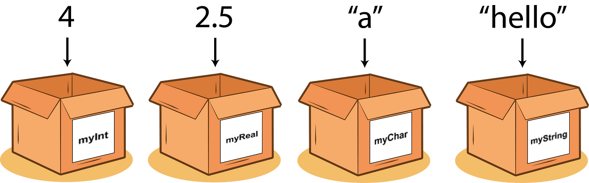

# Primii pași în Python

## Prefață

Pentru a învăța cel mai eficient acest subiect, vă sfătuiesc să copiați codul, să îl rulați și să vă jucați cu el, să vedeți ce funcționează și ce nu.

> Tot codul de mai jos poate fi rulat independent.


## Cod exemplu

Să începem cu un mic fragment de cod din ultima lecție.

```python
name = "Marius"
hello_string = "Hello " + name
print(hello_string)
```

În acest mic program:

1. Începem prin a atribui valoarea "Marius" unei variabile numite `name`.
    * Acest lucru spune calculatorului să își amintească că `name` este `Marius`. Observați că ghilimelele (`"`) indică faptul că este un șir de caractere (string).
2. Creăm o altă variabilă numită `hello_string`, care combină șirul "Hello " cu valoarea stocată în variabila `name`.
    * În programare, putem folosi o variabilă pentru a accesa valoarea pe care o deține. Variabila `name` deține în prezent valoarea `Marius`, iar pentru calculator, `name` și `Marius` sunt aceleași.
    * Operatorul `+` (plus), când este aplicat la șiruri, le va conecta împreună.
3. În cele din urmă, folosim funcția `print()` pentru a afișa valoarea variabilei `hello_string` pe ecran. În acest caz, va tipări "Hello Marius", deoarece valoarea lui `name` este "Marius". Deci, când codul este rulat, va afișa mesajul de salut "Hello Marius" în consolă.

## Ce sunt variabilele

În programare, o variabilă este ca un container care deține o valoare. Puteți să o priviți ca pe o cutie etichetată în care puteți stoca diferite lucruri. Fiecare variabilă are un nume pe care îl alegeți și puteți atribui o valoare.

De exemplu, să ne imaginăm că avem o variabilă numită `score`. Putem utiliza această variabilă pentru a stoca scorul obținut într-un joc. Inițial, variabila poate avea o valoare de 0. Pe măsură ce jucați jocul și câștigați puncte, puteți actualiza valoarea variabilei `score` pentru a reflecta noul scor.

Variabilele sunt utile deoarece vă permit să stocați și să manipulați date în programul dvs. Puteți efectua operații pe variabile, cum ar fi adunarea lor sau schimbarea valorilor în funcție de anumite condiții.



## Cum se declară variabilele

În Python, puteți declara o variabilă urmând aceste reguli:

1. Alegeți un nume pentru variabila dvs.: Numele ar trebui să fie semnificative și să descrie scopul variabilei. Poate conține litere (majuscule sau minuscule), cifre și caracterul de underscore (_), dar trebuie să înceapă cu o literă sau cu underscore. Evitați utilizarea de caractere speciale sau spații în numele variabilelor.

```python
first_name = 'valid'
FIRST_NAME = 'valid'
_firt_name_ = 'valid'
__first_name = 'valid'
$amount = 'not valid'  # Acest cod este incorect...
1_name = 'not valid'  # ...și acesta este incorect
v4r_name = 'valid dar nu recomandat'
```

2. Utilizați operatorul de atribuire (`=`) pentru a atribui o valoare variabilei: După ce ați ales un nume, puteți utiliza operatorul de atribuire pentru a atribui o valoare variabilei. Valoarea poate fi un număr, un șir de caractere, un boolean (True sau False) sau orice alt tip de date.

```python
# Declararea și atribuirea de valori variabilelor
name = "John"  # Atribuirea unei valori de șir
age = 25  # Atribuirea unei valori întregi
is_student = True  # Atribuirea unei valori booleane

# Afișarea valorilor variabilelor
print(name)
print(age)
print(is_student)
```

În exemplul de mai sus, declarăm trei variabile: `name`, `age` și `is_student`. Le atribuim valorile "John" (un șir), 25 (un întreg) și True (o valoare booleană), respectiv. Apoi, utilizăm funcția `print()` pentru a afișa valorile acestor variabile pe ecran.

În Python, variabilele sunt cu tipare dinamic, ceea ce înseamnă că nu trebuie să declarați în mod explicit tipul unei variabile. Tipul este dedus în funcție de valoarea atribuită.

### Atribuirea în lanț

Putem, de asemenea, să atribuim variabile în lanț. Să spunem că programul nostru începe cu două valori care sunt egale.

x este egal cu 10 și y este, de asemenea, egal cu 10.

Putem scrie codul în Python astfel:

```python
# Facem asta
x = y = 10
# În loc de asta
x = 10
y = 10
```

**Notă:** Acest lucru este util numai în situații în care aveți mai mult de o variabilă care are aceeași valoare.

## Ce sunt constantele

În Python,

 constantele nu sunt un concept strict, dar în general, sunt considerate variabile ale căror valori nu se schimbă în timpul execuției programului. Puteți utiliza majuscule pentru a evidenția că o variabilă este considerată constantă, dar aceasta este o convenție și nu o restricție impusă de limbajul Python.

```python
# Exemplu de "constantă" în Python (convenție)
PI = 3.14159
RADIUS = 5.0

# Utilizarea constantelor într-o operație
area = PI * (RADIUS ** 2)
print(area)
```

În acest exemplu, `PI` și `RADIUS` sunt considerate constante deoarece valorile lor nu sunt schimbate în timpul execuției programului. Este important să notăm că Python nu oferă un mod strict de a impune constantele, dar utilizarea majusculelor pentru variabilele considerate constante este o practică comună în comunitatea Python.

## Tipuri de date

În Python, există diverse tipuri de date pe care le puteți utiliza pentru a stoca diferite informații. Câteva dintre cele mai comune tipuri de date sunt:

1. **int (integer):** Folosit pentru a stoca numere întregi. De exemplu: `5`, `100`, `-20`.
2. **float (floating-point):** Folosit pentru a stoca numere cu zecimale. De exemplu: `3.14`, `2.0`, `-0.5`.
3. **str (string):** Folosit pentru a stoca șiruri de caractere. De exemplu: `"Hello"`, `"Python"`, `"123"`.
4. **bool (boolean):** Folosit pentru a stoca valori de adevărat sau fals. De exemplu: `True`, `False`.

Puteți utiliza funcția `type()` pentru a verifica tipul unei variabile.

```python
# Exemple de tipuri de date
integer_variable = 42
float_variable = 3.14
string_variable = "Hello, Python!"
boolean_variable = True

# Folosirea funcției type() pentru a verifica tipurile de date
print(type(integer_variable))  # Afișează <class 'int'>
print(type(float_variable))    # Afișează <class 'float'>
print(type(string_variable))   # Afișează <class 'str'>
print(type(boolean_variable))  # Afișează <class 'bool'>
```

În acest exemplu, am creat patru variabile cu diferite tipuri de date și am utilizat funcția `type()` pentru a afișa tipurile lor.

## Conversia tipurilor de date

Uneori, veți dori să convertiți o variabilă de la un tip la altul. Python oferă funcții încorporate pentru a realiza aceasta.

### Conversia la int și float

```python
# Conversia la int
num_float = 3.14
num_int = int(num_float)
print(num_int)  # Afișează 3

# Conversia la float
num_int = 42
num_float = float(num_int)
print(num_float)  # Afișează 42.0
```

### Conversia la str

```python
# Conversia la str
num_int = 42
num_str = str(num_int)
print(num_str)  # Afișează "42"
```

### Conversia la bool

Pentru `bool`, majoritatea valorilor sunt considerate adevărate, cu excepția valorii `False`, 0, sau valoare vidă.

```python
# Conversia la bool
value = 42
bool_value = bool(value)
print(bool_value)  # Afișează True

empty_str = ""
bool_empty_str = bool(empty_str)
print(bool_empty_str)  # Afișează False
```
