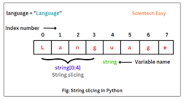
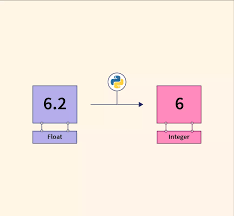

## Recap on string formatting

Best way to format your strings in Python is using F-strings.

F-strings provide a concise and expressive way to format strings in Python. They were introduced in Python 3.6 and later
versions. With f-strings, you can embed expressions and variables directly within a string by prefixing it with the
letter 'f' or 'F'.
Using f-strings should only be done when combining with other variables.
Here's an example:

```python
name = "Marius"  # Not using f-string, because we are not combining with other variables
country = "Moldova"
print(f"I am {name} from {country}")  # Using f-strings as we are combining other variables
```

## Multi Line Strings

Multi-line strings in Python are a convenient way to represent and store text that spans across multiple lines. They are
enclosed in triple quotes (either single or double) and allow you to include line breaks and preserve the formatting of
the text. Here's a brief overview of multi-line strings in Python for beginners:

1. Syntax:
   Multi-line strings are defined using triple quotes (''' or """).
   ```python
   text = '''
   This is a multi-line string.
   It can contain multiple lines of text.
   '''
   ```

2. Line breaks:
   You can include line breaks within a multi-line string simply by pressing Enter. The line breaks will be preserved
   when the string is printed or used elsewhere in the code.
   ```python
   text = '''This is a multi-line string.
   It can span across multiple lines.'''
   ```

3. Preserving formatting:
   Multi-line strings preserve the formatting you provide, including leading spaces and indentation. This is useful when
   working with code examples, paragraphs, or any text that requires specific spacing.
   ```python
   code_example = '''
   def my_function():
       print("Hello, world!")
   '''
   print(code_example)

   paragraph = '''
   This is a long paragraph that needs to be formatted properly.
   It may contain multiple sentences and line breaks.
       Some lines may also have additional indentation.
   '''
   print(paragraph)
   ```

4. Using multi-line strings:
   Multi-line strings can be assigned to variables, printed, concatenated with other strings, or used as docstrings (a
   type of string used to document functions, classes, or modules).
   ```python
   text = '''This is a multi-line string.'''
   print(text)

   text = text + ''' It can be concatenated with other strings.'''
   ```

Multi-line strings are a helpful feature in Python when you need to work with large blocks of text or preserve specific
formatting. They offer flexibility and readability, especially in situations where maintaining the structure of the text
is important.

## Character escaping

In Python, character escaping is a mechanism that allows you to include special characters or symbols within a string by
using escape sequences. Escape sequences are combinations of characters that represent certain special characters and
cannot be interpreted as literals. Here are some common escape sequences in Python:

**Note: Use `print(text)` to test each situation**

1. Backslash (\):
   The backslash character itself can be escaped using another backslash. This is useful when you want to include a
   literal backslash in your string.
   ```python
   text = "This is a backslash: \\"
   ```

2. Newline (\n):
   The newline escape sequence (\n) is used to insert a new line within a string. When the string is printed or
   displayed, the \n is interpreted as a line break.
   ```python
   text = "This is the first line.\nThis is the second line."
   ```

3. Tab (\t):
   The tab escape sequence (\t) inserts a horizontal tab within a string. It is commonly used for indentation or
   aligning text.
   ```python
   text = "Name:\tJohn\nAge:\t25"
   ```

4. Single quote (\'):
   The single quote escape sequence (\') is used to include a single quote within a string that is enclosed in single
   quotes.
   ```python
   text = 'He said, \'Hello!\''
   ```

5. Double quote (\"):
   The double quote escape sequence (\") is used to include a double quote within a string that is enclosed in double
   quotes.
   ```python
   text = "She said, \"Hi!\""
   ```

6. Backspace (\b):
   The backspace escape sequence (\b) is used to remove the previous character in a string.
   ```python
   text = "Hello\bWorld"  # Outputs: HellWorld
   ```

7. Carriage return (\r):
   The carriage return escape sequence (\r) moves the cursor to the beginning of the current line within a string.
   ```python
   text = "Hello\rWorld"  # Outputs: World
   ```

These are just a few examples of escape sequences in Python. They allow you to include special characters, control the
formatting, and handle situations where certain characters need to be represented within a string. By using escape
sequences, you can manipulate and format strings in a more flexible way.

## String as list of characters

Strings in Python are basically a sequence (a list) of individual characters, which means you can perform various
operations on them as you would with a list (It is important to remember for later when we work with lists). Here's a an
overview of how working with strings as lists of characters can be beneficial:

1. Length:
   You can determine the length of a string, i.e., the number of characters it contains, using the `len()` function. It
   returns the total count of characters in the string.
   ```python
   text = "Hello, world!"
   length = len(text)
   print(length)  # Output: 13
   ```

2. Accessing characters using indices:
   Strings can be accessed character by character using indices. Each character in the string has a unique index
   position, starting from 0 for the first character. You can access a specific character by providing its index within
   square brackets.

   

   ```python
   text = "Hello"
   first_char = text[0]
   print(first_char)  # Output: 'H'
   second_char = text[1]
   print(second_char)  # Output: 'e'
   ```

3. Enumerating characters:
   You can iterate over a string as if it were a list to access and process each character individually.
   The `enumerate()` function can be used to retrieve both the index and the character at that index.
   ```python
   text = "Hello"
   for index, char in enumerate(text):
       print(f"Character at index {index}: {char}")
   ```
   Output:
   ```
   Character at index 0: H
   Character at index 1: e
   Character at index 2: l
   Character at index 3: l
   Character at index 4: o
   ```

4. String slicing:
   String slicing allows you to extract a portion of a string by specifying a range of indices. It returns a new string
   containing the selected characters. The slice notation uses the format `[start:stop:step]`, where `start` is the
   starting index (inclusive), `stop` is the ending index (exclusive), and `step` is the number of characters to skip
   between each selected character.

   
   ```python
   text = "Language"
   sub_string = text[0:4]
   print(sub_string)  # Output: "Lang"
   ```

5. Negative Indices:
   Negative indices can be used not only for accessing individual characters in a string but also for string slicing.
   Here's a brief explanation of how negative indices work in both cases:

    1. Accessing individual characters with negative indices:
       Negative indices allow you to access individual characters in a string starting from the end. The index -1
       represents
       the last character, -2 represents the second-to-last character, and so on.
       ```python
       text = "Hello"
       last_char = text[-1]
       print(last_char)  # Output: 'o'
 
       second_last_char = text[-2]
       print(second_last_char)  # Output: 'l'
       ```

    2. String slicing with negative indices:
       Negative indices can also be used in string slicing to extract a portion of the string. When using negative
       indices
       in slicing, the slicing operation starts from the end of the string.
       ```python
       text = "Hello, world!"
       sub_string = text[-6:-1]
       print(sub_string)  # Output: "world"
 
       reversed_string = text[::-1]
       print(reversed_string)  # Output: "!dlrow ,olleH"
       ```

       In the example above, `text[-6:-1]` extracts the substring "world" from the string by counting characters from
       the
       end.

       Using negative indices in string slicing and accessing individual characters allows you to conveniently work with
       the
       end of a string without needing to calculate the exact positions based on its length. This feature simplifies
       code
       and improves readability, especially when you need to access or manipulate portions of a string from the end.

By treating strings as lists of characters, you gain the ability to access individual characters, determine their
positions, iterate over them, and extract substrings using slicing. This allows you to manipulate and work with strings
more flexibly, enabling tasks such as data extraction, transformation, and analysis.

## Methods, String Methods

### What are methods

Methods in programming are **functions** that are associated with specific objects or data types.
They allow you to perform operations or manipulations on the object they are called on. When you call a method on an
object, it works directly with that object and performs a specific task related to it. In Python, strings are objects of
the string data type, and they have various built-in methods that enable you to perform common string operations.

Most objects in python have methods associated with them. You can make a difference between a **function** and a
**method** by the way they are accessed.

A function is usually called by itself: `my_function()` or `result = my_function()`.

A method always has a `.` before it's name, and a variable or value before it: `variable.method_name()`

```python
my_string = 'Hello'
count_ls = my_string.count('l')
count_ys = 'Python'.count('y')
print(count_ys, count_ls)  # 1, 2
```

### String Methods

In the case of strings, methods are functions that can be called on a string object. They allow you to manipulate,
modify, or extract information from the string. These methods are designed to work specifically with strings and provide
convenient ways to perform common operations on them.

Here are some examples of string methods along with their explanations:

1. `count(substring)`:
   The `count()` method returns the number of occurrences of a specified substring within a string.
   ```python
   text = "Hello, hello, hello!"
   count = text.count("hello")
   print(count)  # Output: 2
   ```

2. `lower()` and `upper()`:
   The `lower()` method converts all characters in a string to lowercase, while the `upper()` method converts them to
   uppercase.
   ```python
   text = "Hello, World!"
   lowercase = text.lower()
   print(lowercase)  # Output: "hello, world!"

   uppercase = text.upper()
   print(uppercase)  # Output: "HELLO, WORLD!"
   ```

3. `replace(old, new)`:
   The `replace()` method replaces all occurrences of a specified substring with another substring within a string.
   ```python
   text = "Hello, World!"
   new_text = text.replace("Hello", "Hi")
   print(new_text)  # Output: "Hi, World!"
   ```

4. `split(separator)`:
   The `split()` method splits a string into a list of substrings based on a specified separator. By default, the
   separator is a space.
   ```python
   text = "Hello, World!"
   words = text.split()
   print(words)  # Output: ["Hello,", "World!"]

   sentence = "This-is-a-sentence"
   segments = sentence.split("-")
   print(segments)  # Output: ["This", "is", "a", "sentence"]
   ```

5. `startswith(prefix)` and `endswith(suffix)`:
   The `startswith()` method checks if a string starts with a specified prefix, while `endswith()` checks if it ends
   with a specified suffix. They return a Boolean value indicating the result.
   ```python
   text = "Hello, World!"
   starts_with_hello = text.startswith("Hello")
   print(starts_with_hello)  # Output: True

   ends_with_world = text.endswith("World")
   print(ends_with_world)  # Output: False
   ```

By using methods, you can easily perform various operations on string objects without having to write the logic from
scratch. Methods provide a way to interact with objects and perform actions specific to the object's data type, making
your code more concise, readable, and efficient.

> Important note, for strings, methods do not modify the content of the variable, it generates a new variable leaving
> the old one intact.

```python
value = 'Example'
value.upper()
print(value)  # Value is still Example
value = value.upper()  #
print(value)  # Value is now EXAMPLE
```

Remember, different data types (such as strings, lists, or numbers) have their own set of methods tailored to work with
them. So, when you use methods, you're leveraging the power and functionality that comes with the object you're working
on.

## Type casting



Type casting is a process where the program "transforms" a value from one data type to another.

For example, number 1 can be an int, but it can also be a string.

```python
number = '1'
```

The problem is that even though it looks like a number, we cannot do mathematical operations on it, this is because
Python thinks it is a string.

```python
number = '1'
print(number * 2)  # Prints 11
```

We can `cast` the string to a different data type.

Type casting, also known as type conversion, is the process of converting one data type to another. It allows you to
change the interpretation and behavior of data, enabling compatibility between different types and facilitating
operations that require consistent data representations.

Casting allows you to convert a string that represents a number into an actual numeric value. This can be useful when
you need to perform mathematical operations or comparisons on string-based numerical data. Here's a beginner-friendly
explanation of casting strings to numbers in Python:

> Note: Casting only works if the two types are compatible and supported.

1. Integer casting:
   You can cast a string to an integer using the `int()` function. It removes any leading or trailing spaces and
   converts the string to an integer.
   ```python
   num_str = "42"
   num = int(num_str)
   print(num)  # Output: 42
   ```

2. Floating-point casting:
   To cast a string to a floating-point number, you can use the `float()` function. It converts the string to a
   floating-point value, allowing decimal places and floating-point arithmetic.
   ```python
   float_str = "3.14"
   float_num = float(float_str)
   print(float_num)  # Output: 3.14
   ```

3. Handling invalid conversions:
   It's important to note that not all strings can be successfully cast to numbers. If a string cannot be interpreted as
   a valid number, a `ValueError` will be raised. We will later learn how we can handle such errors, but for now, we
   should try to avoid them.
   ```python
    invalid_str = "Hello"
    invalid_num = int(invalid_str) # Raises ValueError
    print(invalid_num) 
   ```

4. Other numeric conversions:
   In addition to `int()` and `float()`, there are other built-in functions for specific conversions:
    - `complex()` converts a string to a complex number.
    - `bin()` converts an integer to a binary string.
    - `hex()` converts an integer to a hexadecimal string.
    - `oct()` converts an integer to an octal string.

Casting strings to numbers allows you to perform mathematical operations, comparisons, or any other tasks that require
numeric values. However, it's important to ensure that the string represents a valid number, or handle exceptions
appropriately when dealing with potential conversion errors.

Casting can be useful to us when we want to make small programs that use data from the `input()` function to perform
mathematical operations. We will have plenty of such exercieses in the upcoming future.

## Aditional Math Operations


Last time we discussed some basic mathematical operations, such as addition, multiplication, division and subtraction.
This time we are going to discuss a few more operations, which often come useful.

1. Modulo (%):
   The [modulo](https://en.wikipedia.org/wiki/Modulo) operator, represented by the percent symbol (%), calculates the
   remainder of a division operation. It
   returns the remainder when one number is divided by another.
   ```python
   result = 15 % 4
   print(result)  # Output: 3
   ```

   In the example above, 15 divided by 4 equals 3 with a remainder of 3.

2. Exponentiation (`**`):
   The exponentiation operator, represented by two asterisks (**), raises a number to a power. It performs
   exponentiation, which is the process of multiplying a number by itself a specified number of times.
   ```python
   result = 2 ** 3
   print(result)  # Output: 8
   ```

   In the example above, 2 raised to the power of 3 equals 8.

3. Floor division (//):
   The floor division operator, represented by two forward slashes (//), performs division between two numbers and
   rounds down the result to the nearest whole number (integer). It discards the decimal part of the division.
   ```python
   result = 15 // 4
   print(result)  # Output: 3
   ```

   In the example above, the result of 15 divided by 4 is 3.75, but floor division rounds it down to 3.

Modulo, exponentiation, and floor division are useful mathematical operations that you may encounter when working with
numbers in Python. Modulo can help you determine divisibility, find remainders, or cycle through a pattern.

Exponentiation allows you to calculate powers and perform exponential growth or decay calculations.

Floor division is handy when you want to divide numbers and obtain only the whole part of the result. Understanding and
utilizing these operators can enhance your ability to manipulate and perform calculations with numbers in Python.

## Augmented Assignment Operators

Augmented assignment operators in Python provide a concise way to perform an operation and assign the result back to the
same variable. They combine an arithmetic or bitwise operation with assignment in a single statement. Here's a detailed
explanation of augmented assignment operators:

1. `+=` (Add and Assign):
   The `+=` operator adds a value to a variable and assigns the result back to the same variable.
   ```python
   x = 5
   x += 3  # Equivalent to x = x + 3
   print(x)  # Output: 8
   ```

2. `-=` (Subtract and Assign):
   The `-=` operator subtracts a value from a variable and assigns the result back to the same variable.
   ```python
   x = 10
   x -= 4  # Equivalent to x = x - 4
   print(x)  # Output: 6
   ```

3. `*=` (Multiply and Assign):
   The `*=` operator multiplies a variable by a value and assigns the result back to the same variable.
   ```python
   x = 3
   x *= 2  # Equivalent to x = x * 2
   print(x)  # Output: 6
   ```

4. `/=` (Divide and Assign):
   The `/=` operator divides a variable by a value and assigns the result back to the same variable.
   ```python
   x = 10
   x /= 2  # Equivalent to x = x / 2
   print(x)  # Output: 5.0
   ```

5. `%=` (Modulo and Assign):
   The `%=` operator calculates the modulo (remainder) of a variable divided by a value and assigns the result back to
   the same variable.
   ```python
   x = 15
   x %= 4  # Equivalent to x = x % 4
   print(x)  # Output: 3
   ```

Augmented assignment operators are a shorthand way to perform common operations on variables while updating them in
place. They can make your code more concise and readable, especially when you need to repeatedly modify a variable based
on a certain operation.
