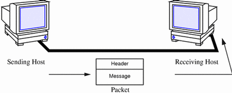
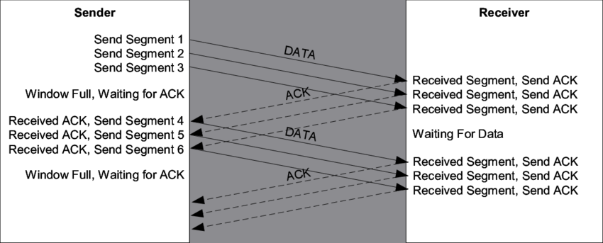
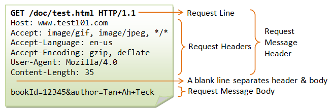
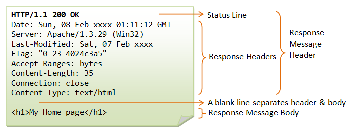

# Understanding the WEB


The WEB is all around us, and it is the key factor that allows us to connect with people all around the world.

From big servers, to small embedded devices, humanity has developed the ability to provide seamless communication and
integration across vast amounts of distances and applications.

The internet has allowed us to experience new things, and gather knowledge from all across the world.

But how does it work ?

## The Internet

The internet is a global network, of interconnected networks.

The internet works using combinations of communication protocols also known as *TCP/IP*.

The internet is developed in such a way, that every network can function as a self-sustained network, and can connect to
other networks.

You can think of it as each network being a City, that's connected to other cities through motorways and roads.

Networks can be categorized by scope. The most important for us to know are: LAN and WAN

### LAN - Local Area Network

Local area networks are networks with limited range.

In this type of networks, devices are connected by a medium (Cable, Wi-Fi, Bluetooth) in which the range of that
connection is limited.

There are different levels of local networks.

One local network is you computer. Inside this local network, all of your programs can communicate with the system and
with each other.

For example, when you create a local server, it can be only available to your local network. This means that other
programs on your computer have access to that server, while other computer may not.

A bigger example of a local network is your home. In your home, all the devices are connected to the home network. This
means that one computer can easily communicate with another one. This is for example how you can print papers on from a
computer to a printer in another room without them being connected directly via a cable. In the same way, you can cast
videos to your TV, etc...

### WAN - Wide Area Network

Wide Area networks are networks connected to other networks through a communication network.

The communication network is usually provided by an Internet Service Provider.

This communication network allows Local Area Networks to connect to each-other, and establish a wider network.

On the largest scale, the internet is a WAN. As other WANs are connected to each others, and in result, all networks
connected to a WAN are connected to each other. This is how your computer can access a website that is on a server in a
different country, perhaps even a different continent.

## Finding our way around the web

### IP Addresses

How does your computer know where to find a different computer, in a different LAN, across a vast amount of different
connections.

This is where IP Addresses come in. IP Addresses are similar to street addresses. Across the web each device connected
to an internet has an IP Addresses.

IP Addresses come in 2 variations: IPv4 and IPv6

#### IPv4

IPv4 Addresses are numerical labels assigned to a device on a network.

They look like this: 192.0.1.2 and have the following structure: a.b.c.d

Each number in an IP address should be inside the range of 0 to 255 inclusive.

This provides a range of 4,294,967,296 addresses. Which might seem like a lot, and indeed it was a lot for when the
standard was established, but over the years, the internet has exploded meaning that it was required to establish a new
address.

IPv4 is still widely used, and is more than enough for local networks. But when that is not enough, we always have IPv6.

#### IPv6

IPv6 is more recent standard used for network identification, that comes as a replacement for IPv4.

IPv6 addresses look like this 2001:0db8:0000:0000:0000:8a2e:0370:7334 or a shorter version 2001:db8::8a2e:370:7334.

They allow us to have 3.4×10 ^ 38 total addresses.

IP Addresses are what allow us to access resources across the WEB. In fact, when you access the website, it's accessed
using the IP Address, just your browser hides that from you.

### Ports

A port is a communication endpoint, within the operating system, so if the IP is the address, the port is **like the
apartment number**, on the street where your apartment building is located.

Ports are used by software to establish where exactly on the address can the necessary application be found.

For example, WEB Servers usually work on the 8080 port. A Web server on a local network can then be accessed by its IP
and the port, example: _127.0.0.1:8080_.

Other examples of ports are as follows:

* FTP (File transfer protocol): 20 or 21
* SSH (Secure shell protocol): 22
* HTTPS (SSL/TSL): 443

### DNS

Knowing that all traffic inside the internet is accessed using IP addresses you start to wonder, how haven't you perhaps
never seen an IP Address until now, and never needed to know what it is.

You can thank DNS for this.

DNS - Domain Name System is a naming system, that holds the records of each IP and a name associated with it.

For example: google.com = 172.217.168.196

DNS allows us, internet users to have a convenient way to access resources, you wouldn't want to remember the IP address
for every website you use.

Aside from that, DNS records are localized, for example google.com may point to one IP Address here in Moldova, and a
different one in Germany. That's because it's faster to access a server that is closer to Moldova, than to access a
server further away.

## Computer communication

Computers communicate with each other by sending data, alongside other information inside a packet.

It actually works very similar to how postal services work.

Each packet contains information about the sender, and about who should receive that package. Each packet also contains
data, called **payload**, which is the message we want to send.



The payload is the information we want to transfer to the other computer.

When the packet is sent, a very smart network of interconnected devices work together to make sure that the packet gets
to the necessary destination.

## Protocols

Protocols are standardized communication procedures, that describe the format of the information passed between the two
or more parties that are communicating.

An example of a protocol can be taken from human communication. For example the communication of 2 persons.

```
A: Hi how are you?
B: I'm fine thank you, and you ?
A: I'm fine as well.
```

The example above is how a communication between two people usually starts. It may not always be like this, but it's
similar, and we know that when someone asks you how are you, you ask them back.

With computers, it's the same way. Protocols are pre-established formats of communication, that are created to ensure
both "computers" in a "_conversation_" are aware of what is being sent and how the message should be processed upon
receiving.

### TCP and UDP

TCP and UDP are two important data transmission protocols, that are commonly used to transmit data over the internet.

They are both similar and different in many ways.

The main difference between them is speed and reliability.

TCP is a very reliable protocol, that assures that the data is sent and received, in the same order that it is sent.

Over TCP, each packet of information that is sent, is acknowledged, and if an acknowledgement is not returned from a
packet, it's sent again.



TCP is used in Data transfer, file transfer and others.

UDP on the other hand is used for high speed, but less reliable data transfers.

Under UDP, packets are sent without waiting for an acknowledgement. You can think of it as firing a machine gun.

UDP only knows that it sent the package, and where it sent to, but it never cares if the package was received.

UDP is mostly used for continuous data streaming, such as for example video chats, or voice calls, where speed is more
important than reliability.

If a voice or video call was done using TCP, then at some point, there would be a massive delay between the two callers.
With UDP, although we miss some parts of a sentence we are always receiving fresh information, with less delay.

## URLs

URL is the way to find a resource inside a web server or web resource.

We call them 'links', but URL stands for Uniform Resource Locator.


* Scheme: Indicates the protocol we want to use
* Authority: Indicates which server web server is being requested, together with the port
* Path to resource: Indicates the path of the required file, webpage or general web resource. Paths are similar to the
  paths of your files on your computer.
* Parameters are a way to "customize" what the web resource will display, similar to arguments in a function.
* The anchor is a reference to a specific part of a document.

## HTTP

Hypertext Transfer Protocol (HTTP) is a protocol for transmitting hypermedia documents, such as HTML. It was designed
for communication between web browsers and web servers, but it can also be used for other purposes, for example
transmitting JSON.

HTTP is by far the most accessible way of sending and/or receiving data.

You already know HTTP because it's everywhere in our web browser. Every website you open, every message you receive and
vast amounts of data shown on your computer, or on your phone, is being transmitted over HTTP.

HTTP is a Client-Server protocol, meaning that in HTTP, there is always a **Client** - like a client of a restaurant,
and a **Server** - the waiter at the restaurant that will deliver you the food.

### The client

The client (for example the web browser) can do 2 things: Send Requests and Receive responses. (By similarity, the
client can order food, and eat it).

By creating an HTTP request, the client is requesting a certain resource from the server.

Take this URL for example: `https://en.wikipedia.org/wiki/Hypertext_Transfer_Protocol`

The client (the web browser) is requesting the page for `Hypertext_Transfer_Protocol` from the `wiki` "folder" on the
`en.wikipedia.org` web server.

What is missing from this URL is the port: 443 which in the browser automatically detects because of the schema (https).

After the server processes the request, it will return the requested resource - the HTML web page, with all the
information needed.

An HTTP Client **will not** and **can not** receive information that was not requested. That is by similarity, a Waiter
cannot give the food to a client that has not ordered yet. The waiter is only allowed to give food that was explicitly
Requested.

### The server

Following the same example, the web sever has the responsibility of receiving a request with from the client and sending
a response.

What the server will know (or need to know) is the requested page. Alongside some other information about who requested
it.

The web server will detect that someone is requested to see the `wiki` for the topic `Hypertext_Transfer_Protocol`.

It will find the necessary information, and create the response to send to the client. For this, it will need to know
the address (ip address) of the client.

An HTTP Server **can not** and **will not** send responses without an HTTP Request. I.e. It will not prepare food if
there is no-one ordering it.

### HTTP in action

HTTP as a protocol is made up of an HTTP Request and a HTTP Response.

## HTTP Requests

HTTP Requests must follow a specific structure - The protocol.

HTTP Requests can be of various types (also called methods). Most used ones are **GET** and **POST**.

The methods are used to tell the server the **intent** of the client, or in simple terms, what does the client want to
do.

According to the standard, the client should send a **GET** request if he intends to ask for information, and use
**POST** if he intends to ask the server to store data.

HTTP Requests have the following structure



1. A request line - Specifies the method and the resource
2. Request headers - Additional information about the request and the client requesting it
3. Request body - Specific parameters for our requests

All together, these 3 components make up an HTTP Request.

All HTTP Requests will have a response, if the server can not be reached, the HTTP request will result in a timeout.

### Get

HTTP GET Method is used to ask a server for data.

Parameters for a GET request are included in the URL which are automatically processed by the client application (
example our browser).

GET Requests are used to fetch data (similar to how we used getter methods to get information from our objects)

For example:
Get a list of users: `http://example-website.md/users/list`
Get a list of users that start with Mar: `http://example-website.md/users/list?startwith=Mar`

### Post

HTTP POST Method is used to send data to a server.

POST Requests have the advantage of being able to send larger amount of data than GET requests, mainly because the body
of a POST request is not part of the URL, it's separate from it.

URLs have a limit to the amount of characters they can hold, while POST can contain largely more complex data.

The fact that POST requests don't store the information inside the URL also means that it is more secure, especially
when the request is encrypted.

## HTTP Responses

Responses are only sent from a web server as a result of a request.

Responses also have both headers and a body.

Responses will contain the following information:

1. Response satus - A code indicating the result of the requests
2. Response headers (Additional information about the request and the server)
3. Response body - Optional



Response status codes are what the sends to indicate what is the result of the request.

There are various response codes, that are used to represent various situations.

For example, code 200, means everything is fine, code 404 means "not found", etc...

The response body is optional because it may often be the case that there is no body, or a body is not needed.

For example, if I send a request to save a new user, I can either return the new user in the requests' body, or it can
just return an empty response with status 200, indicating that the request was a success.

### HTTP Status codes

HTTP Status codes have a wide variety of meanings. Most common of them are found below.

| Status Code | Meaning            | When its used                                                                                                                   |
|-------------|--------------------|---------------------------------------------------------------------------------------------------------------------------------|
| 200         | OK                 | When the response was successful (may contain body)                                                                             |
| 201         | Created            | When a new resource was created as a result of a request                                                                        |
| 202         | Accepted           | The request was fine, but the action was not triggered yet - For example, the file is scheduled for processing some times later | 
| 204         | No content         | The request was received but there is nothing to return                                                                         |
| 300         | Multiple choice    | Multiple options for the response are available, client must choose                                                             |
| 301         | Moved permanently  | The resource is not available at the location, the response contains the new URL                                                |
| 400         | Bad request        | Request information is not valid, and the server doesn't want to process it                                                     |
| 401         | Unauthorized       | Request requires authentication, and the client doesn't have proper authentication to access the resource                       |
| 403         | Forbidden          | User is authenticated but does not have permissions to access the resource                                                      |
| 404         | Not Found          | Resource could not be found                                                                                                     |
| 405         | Method not allowed | Server doesn't allow that request method for the resource. (Using GET instead of POST for a resource for example                | 

## Making a Web Client in Python

In order to be a web-client, we need to be able to make requests, and process responses.

To do that in Python, we need to use a special library: requests.

Use `pip install requests` - to install it.

```python
import requests

response = requests.get('http://google.com/')  # Sending a GET Request to google.com
print(response.content)  # Will print out the HTML code of the requested website
print(response.status_code)  # Will print out the HTTP Status of the response
for header, value in response.headers.items():  # Will print out the headers for the response
    print(header, value)
for cookie, value in response.cookies.items():  # Will print out the response cookies
    print(cookie, value)
```

The response from most usual websites will be an HTML page, or the type of the resource on the web server.

For example, if you request for an image, you will receive bytes data for that image.

```python
import requests

python_logo = requests.get('https://www.python.org/static/community_logos/python-logo-master-v3-TM.png')
with open('python_logo.png', 'wb') as file:  # Opening file to write bytes
    print(python_logo.headers.get('Content-type'))
    # image/png
    file.write(python_logo.content)
```

### APIs

Special online resources (called APIs) can return files (bytes), textual formats (JSON/XML/raw text). But JSON is
nowadays the most common.

APIs are easier to work with, because they provide direct data. Websites (html) are getting progressively harder to work
with, as the data they provide is processed on the client side (using scripts that run in the browser).

Special tools have been created that "simulate" the browser and can be controlled using python, and thus allow us to
easily access info from websites.

We are going to discuss them next session.

```python
import requests

url = "https://community-open-weather-map.p.rapidapi.com/weather"

querystring = {"q": "Chisinau,MD", "lang": "null", "units": "metric", "mode": "json"}
# q for the location to search
# lang: language for the response (Default English)
# units: metric or imperial (Celsius or Fahrenheit)
# mode: json/xml/text - how to return the information

headers = {
    'x-rapidapi-key': "9fc02c456bmsh6626cffb86bc4a3p13dc03jsn476488b50c4e"
}

response = requests.request("GET", url, headers=headers, params=querystring)

data = response.json()
print(data['coord'])
# {'lon': 28.8575, 'lat': 47.0056}
print(data['weather'])
# [{'id': 800, 'main': 'Clear', 'description': 'clear sky', 'icon': '01n'}]
print(data['main'])
# {'temp': 2.42, 'feels_like': -1.03, 'temp_min': 1.63, 'temp_max': 2.74, 'pressure': 1032, 'humidity': 68}
```

The above API will get weather data.

# Nice videos

[IP](https://www.youtube.com/watch?v=aor29pGhlFE&ab_channel=Techquickie)

[DNS](https://www.youtube.com/watch?v=Rck3BALhI5c&ab_channel=Techquickie)